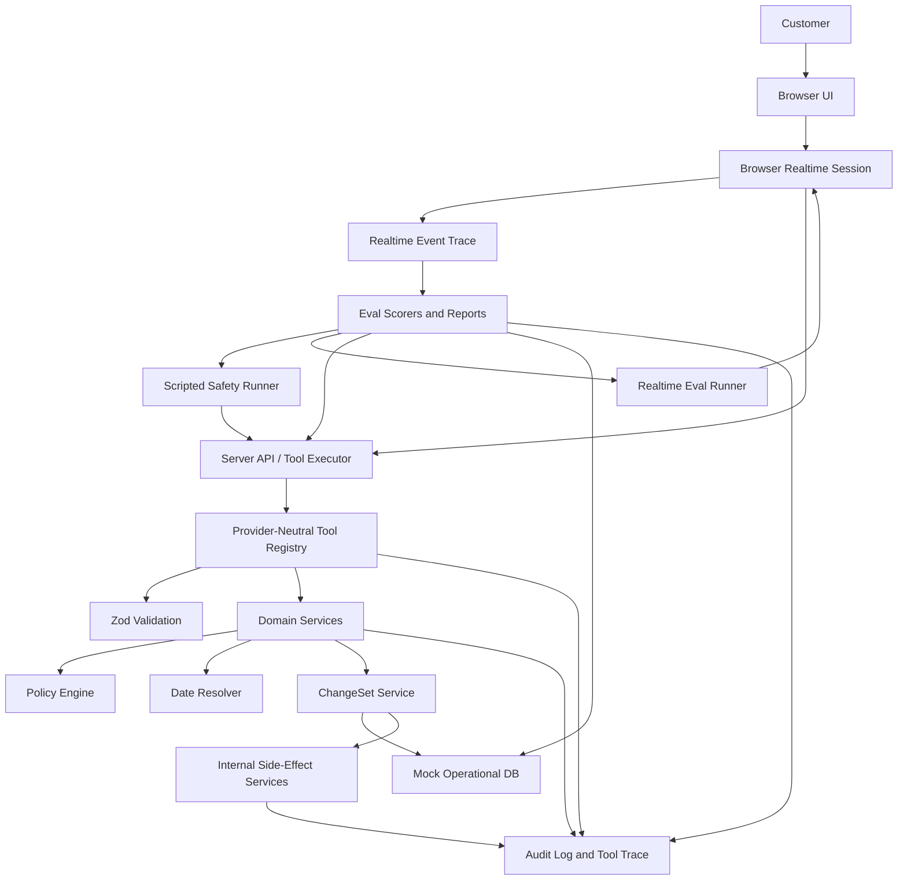

# MealPlan VoiceOps Implementation Plan

Status: draft for first demo milestone, checkpointed for handoff
Source docs: `SPEC.md`, `TASKS.md`, `AGENTS.md`  
Last updated: 2026-05-12

## 1. Objective

Build the first demoable version of MealPlan VoiceOps: a realtime contact-center voice agent that can safely handle the primary meal-plan scenario end to end. The product runtime is OpenAI Realtime with tool calling. The scripted runner remains an engineering safety harness for the operational backend, not the product experience.

The first milestone is not a production system. It is a production-shaped vertical slice with enough real architecture that a reviewer can inspect the safety boundary and run repeatable evidence locally.

## 2. Demo Checkpoints

The milestone is split into checkpoints so the safety architecture remains inspectable while the realtime agent becomes the product path.

Checkpoint A: scripted safety baseline

- Waves 0 through 4 complete.
- `pnpm test` passes policy, ChangeSet, tool, DB, date resolver, and scorer tests.
- `pnpm eval` defaults to scripted mode, runs 20 replay cases without OpenAI credentials, and reports hard policy violations, final state correctness, required and forbidden tool usage, confirmation boundaries, and audit completeness.
- The Maya scenario works through the scripted safety harness:
  - identify customer,
  - read current plan,
  - resolve "next week" into exact dates,
  - identify Tuesday as non-scheduled,
  - preview Monday pause and spice update,
  - read failed payment status,
  - preview payment follow-up task creation without marking payment paid,
  - require server-captured explicit confirmation before commit,
  - create payment follow-up as a committed ChangeSet operation,
  - create kitchen delta internally only after commit,
  - write audit events for reads, preview, confirmation capture, commit, and side effects.

Checkpoint B: realtime runner and Crawl proof

- Waves 5 and 6 complete.
- A server-side Realtime runner can start a `gpt-realtime-2` session over WebSocket, send clean audio fixtures, receive events and tool calls, execute those tool calls through the existing server-side tool executor, and produce eval-compatible run output.
- Crawl evals cover 5-10 clean-audio routing and policy cases.
- The realtime agent prompt, tool definitions, event trace, audit capture, and final state capture are inspectable.
- No browser UI is required for this checkpoint.

Checkpoint C: browser realtime demo

- Wave 7 complete.
- Browser voice uses WebRTC with ephemeral credentials only.
- Realtime tool execution remains server-side.
- The visible demo shows transcript, tool timeline, audit events, preview/diff, and explicit confirmation.

Checkpoint D: Walk/Run portfolio proof

- Wave 8 complete.
- Walk evals exercise noisy or phone-like single-turn audio.
- Run evals exercise multi-turn contact-center behavior such as clarification, correction, interruption, tool failures, policy blocks, and escalation.
- README and docs explain the architecture, guardrails, realtime eval stages, run commands, demo script, and limitations.

## 3. Architecture Position

The core system is the operations backend and server-side tool executor. The realtime model is allowed to converse and request tools, but it is still only a client of that backend.

The implementation should be layered in this order:

```text
Domain schemas
  -> seed data and resettable mock DB
  -> audit log
  -> policy engine
  -> date resolver
  -> ChangeSet service
  -> typed tools
  -> provider-neutral tool registry
  -> deterministic scripted runner and evals
  -> realtime agent prompt and tool definition adapter
  -> minimal server-side realtime runner
  -> realtime Crawl evals
  -> browser realtime demo
  -> Walk/Run realtime evals
```

The realtime layer must not contain domain rules, write logic, policy decisions, or its own tool registry. Realtime sessions, scripted mode, model-backed mode, browser demo mode, and eval replay mode should all call the same server-side tool executor and policy-backed services.

## 4. Central Safety Invariant

The implementation must make this invariant mechanically true:

```text
No model output can directly mutate operational state.

Operational write:
  proposed operations
  -> ChangeSet stored with expected_state_version
  -> policy validation
  -> preview with before/after delta
  -> server-created confirmation_id from an explicit user turn
  -> commit-time policy validation
  -> state_version check
  -> commit
  -> internal post-commit side effects
  -> audit log
```

Anything that bypasses this flow is a bug, even if the user-facing answer sounds correct.

Two derived rules matter for implementation:

- All operational writes go through ChangeSets. Payment follow-up task creation is a ChangeSet operation.
- Kitchen export deltas are internal side effects derived after commit. They are not model-facing tools or model-facing ChangeSet operations.

The model cannot manufacture a confirmation object. It may request commit with a `confirmation_id`, but the server must create that confirmation record only after a preview and only from the actual next user turn for the same run, customer, and ChangeSet.

## 5. Policy ID Baseline

Policy results must use stable IDs so tests, audit logs, and eval reports are inspectable:

- `P001_IDENTITY_UNCERTAIN`
- `P002_AMBIGUOUS_DATE`
- `P003_MISSING_PREVIEW`
- `P004_MISSING_CONFIRMATION`
- `P005_STALE_STATE_VERSION`
- `P006_EXPIRED_CHANGESET`
- `P007_ALLERGY_MUTATION_FORBIDDEN`
- `P008_MEDICAL_RISK_ESCALATION_REQUIRED`
- `P009_PAYMENT_SETTLEMENT_FORBIDDEN`
- `P010_KITCHEN_DELTA_BEFORE_COMMIT_FORBIDDEN`
- `P011_CUSTOMIZATION_OVERWRITE_REQUIRES_DELTA`

## 6. First Demo Scope

In scope:

- One realistic meal-plan domain.
- In-memory resettable DB, not a production database.
- Zod schemas for every domain entity and tool contract.
- A small policy engine with explicit hard policy IDs.
- ChangeSet preview and commit lifecycle.
- Typed tool registry independent of model provider.
- Deterministic scripted runner for backend safety evals.
- `scripted`, `model`, and `realtime` eval modes, with `scripted` as the no-credentials default.
- 20 eval cases, starting with scripted runs.
- Minimal server-side Realtime runner for automated evals.
- Realtime Crawl evals using clean deterministic audio fixtures.
- Browser realtime demo using server-side API credentials and browser-side ephemeral credentials.
- Walk/Run realtime eval stages for noisy audio and multi-turn contact-center workflows.
- Documentation and demo script.

Out of scope:

- Real payments, real CRM, real SMS, real kitchen PDFs.
- Production auth or multi-tenant deployment.
- Complex dashboards.
- A generic agent framework before the first real vertical path works.

## 7. Target Runtime Shape



## 8. Implementation Waves

### Wave 0: Repository Foundation

Goal: create a working project shell and preserve the required commands from the start.

Gate to exit:

- `pnpm dev`, `pnpm test`, `pnpm eval`, and `pnpm lint` exist and run.
- No source file starts as an oversized catch-all.
- Placeholder eval output is clearly marked as temporary implementation scaffolding.

Tickets:

#### MVP-001: Next.js TypeScript Scaffold

Scope:

- Add Next.js App Router, TypeScript, pnpm scripts, lint config, Vitest config.
- Add a minimal app page that proves the dev server starts.
- Add `src/domain/schema.ts`, `src/evals/runEval.ts`, and `tests/smoke.test.ts`.

Acceptance:

- `pnpm install` succeeds.
- `pnpm dev` starts.
- `pnpm test` passes.
- `pnpm eval` prints a temporary report.
- `pnpm lint` runs.

Review focus:

- Keep setup minimal.
- Do not implement OpenAI Realtime or UI panels yet.

#### MVP-002: Project Conventions and File Boundaries

Scope:

- Add baseline folder structure for code that is immediately used.
- Document module ownership in comments or README where helpful.
- Ensure `AGENTS.md` constraints are reflected in initial scripts and file layout.

Acceptance:

- No empty future-only folders.
- All created modules are referenced by tests, app, or eval command.
- No source file exceeds 350 lines.

Review focus:

- Avoid over-scaffolding.

### Wave 1: Domain Spine

Goal: create the operational state model before tools or model behavior.

Gate to exit:

- Seed scenarios validate through Zod.
- DB can reset per test/eval run.
- Audit events can be appended and queried by run.

Tickets:

#### MVP-101: Domain Schemas

Scope:

- Implement Zod schemas and inferred types for Customer, Plan, ServiceDate, PaymentFollowup, KitchenExportDelta, ChangeOperation, ChangeSet, Confirmation, AuditEvent, PolicyResult, and ToolResult.

Acceptance:

- Schemas cover the entities in `SPEC.md`.
- Types are exported from a small set of domain modules.
- Tests validate representative valid and invalid payloads.

Review focus:

- Prefer explicit discriminated unions for operations.
- Keep schema files readable and split before they get large.

#### MVP-102: Seed Scenarios

Scope:

- Implement seed data for Maya, Omar, Lina, and duplicate/uncertain identity.
- Include next service dates and payment details needed by first evals.

Acceptance:

- Seed data validates with Zod.
- Maya has Monday, Wednesday, Friday deliveries starting 2026-05-18.
- Maya has failed payment and normal spice.
- Omar covers a locked kitchen cutoff.
- Lina covers allergy risk.
- Duplicate identity data forces clarification or escalation.

Review focus:

- Dates must match the fixed eval reference date of 2026-05-11.

#### MVP-103: Resettable Mock DB

Scope:

- Implement in-memory repository with `resetDb`, `findCustomers`, `getCustomer`, `getCustomerState`, `saveChangeSet`, `getChangeSet`, `updateCustomerState`, `appendAuditEvent`, and audit query helpers.

Acceptance:

- DB resets between tests and eval cases.
- State version is persisted and incrementable.
- ChangeSets and side effects are stored separately from customer state.
- Tests cover reset isolation and read/update paths.

Review focus:

- No hidden singleton state that leaks across eval cases without reset.

#### MVP-104: Audit Log Foundation

Scope:

- Implement audit event creation helpers and audit event types.
- Support run-scoped audit logs.

Acceptance:

- Read, proposed change, preview, confirmation, commit, block, side effect, and escalation event types exist.
- Tests prove event append and query order.

Review focus:

- Audit should record policy decisions and tool names, not just free text.

### Wave 2: Policy, Dates, and ChangeSets

Goal: make the safety boundary work without any model or UI.

Gate to exit:

- Hard policies are enforced by service tests.
- ChangeSet commit fails without confirmation, on stale state, on ambiguity, and on hard policy violations.
- Preview produces user-visible before/after deltas.

Tickets:

#### MVP-201: Policy Engine

Scope:

- Implement `mealplan.policy.ts` with `P001_IDENTITY_UNCERTAIN` through `P011_CUSTOMIZATION_OVERWRITE_REQUIRES_DELTA`.
- Return structured `PolicyResult` values with stable policy IDs.

Acceptance:

- Tests cover every hard policy in allowed and blocked cases.
- Allergy mutation blocks and escalates.
- Payment settlement actions are impossible to express or blocked if attempted.
- Kitchen delta before commit is blocked internally and is not exposed as a model-facing operation.

Review focus:

- Policies should inspect structured operations, not natural-language summaries.

#### MVP-202: Date Resolver

Scope:

- Implement deterministic date resolution using customer timezone, fixed reference date, delivery days, and next service dates.
- Handle next week, tomorrow, this weekend, and named weekdays for first evals.

Acceptance:

- Tests cover Maya next week Monday, Tuesday, Wednesday.
- Non-scheduled days are returned as non-actionable.
- Ambiguous phrases return `ambiguous=true` and a clarification question.
- Ambiguous dates cannot be converted into write operations.

Review focus:

- Keep date resolution deterministic for evals.

#### MVP-203: ChangeSet Lifecycle

Scope:

- Implement create, validate, preview, server confirmation capture, commit, expire, and idempotent committed read behavior.
- Store expected state version and expiry.

Acceptance:

- Preview does not mutate operational state.
- Commit accepts `confirmation_id`, not raw confirmation text or a model-created confirmation object.
- Confirmation records are server-created for the same run, customer, and ChangeSet after preview.
- A model cannot commit by inventing a confirmation object.
- Commit checks current state version against expected state version.
- Expired ChangeSet cannot commit.
- Customization overwrite preview includes before and after values.
- Commit increments customer state version once.
- Repeated commit of an already committed ChangeSet is idempotent.

Review focus:

- Commit-time validation must not trust earlier validation.

#### MVP-204: Side-Effect Services

Scope:

- Implement internal kitchen export delta creation and idempotent materialization for payment follow-up operations.
- Enforce side-effect eligibility in code, not UI or model instructions.

Acceptance:

- Payment follow-up can only be created by a committed `create_payment_followup` ChangeSet operation for failed, past_due, or unknown status.
- Payment status is never changed to paid.
- Kitchen delta can only be created internally after a committed ChangeSet affects meal operations.
- Repeated commit does not create duplicate payment follow-ups or kitchen deltas.
- Side effects use idempotency keys derived from `change_set_id` plus operation identity.
- Side effects append audit events.

Review focus:

- Side effects should be mock internal records only.

### Wave 3: Typed Tools and Agent Contracts

Goal: expose the operational engine through typed tools that any model adapter can use.

Gate to exit:

- Every tool has Zod input schema, Zod output schema, typed `ToolResult`, risk metadata, and tests.
- Tool registry is provider-neutral.
- Blocked tool calls produce structured errors and audit events where appropriate.

Tickets:

#### MVP-301: Tool Contract Types and Registry Shape

Scope:

- Define common tool type, risk levels, `ToolResult`, and registry metadata.
- Add a registry export that is independent of OpenAI-specific formats.
- Define hidden run context for tool execution: `run_id`, `session_id`, actor, current user turn ID, last user message, and identity status.

Acceptance:

- Tools can be executed directly by tests and eval runner.
- Provider adapter can map registry tools later without changing domain tools.
- The model supplies business arguments only; server context is injected by the tool executor.

Review focus:

- Avoid coupling tool definitions to Realtime transport.

#### MVP-302: Read and Planning Tools

Scope:

- Implement `lookup_customer`, `get_customer_state`, `resolve_service_dates`, and `get_payment_status`.

Acceptance:

- Inputs and outputs validate through Zod.
- Reads log audit events.
- Identity uncertainty is explicit and blocks later writes.
- Payment tool exposes allowed and forbidden actions.

Review focus:

- Reads should not leak full customer state before identity is resolved.

#### MVP-303: ChangeSet Tools

Scope:

- Implement `create_change_set`, `validate_change_set`, `preview_change_set`, `capture_confirmation`, and `commit_change_set`.

Acceptance:

- Tools call ChangeSet and policy services.
- No write occurs before explicit confirmation.
- `commit_change_set` accepts `change_set_id` and `confirmation_id`, not raw confirmation text.
- Blocked changes return policy IDs.
- Preview includes non-actionable requested items.

Review focus:

- Tool implementations should be thin adapters over domain services.

#### MVP-304: Escalation Tool and Internal Side-Effect Contract

Scope:

- Implement `escalate_to_human`.
- Ensure payment follow-up is expressible only as a ChangeSet operation, not a standalone write tool.
- Ensure kitchen export delta creation is internal-only after commit and absent from the model-facing registry.

Acceptance:

- Model-facing tools do not include `create_kitchen_export_delta`.
- Model-facing tools do not include standalone `create_payment_followup`.
- Kitchen delta before commit is blocked by policy and service checks.
- Payment follow-up does not change payment status.
- Allergy and medical risk escalations are audit logged.

Review focus:

- Escalation is allowed for risk, but it must still be logged.

#### MVP-305: Agent Instructions

Scope:

- Add concise agent instructions that describe allowed behavior, prohibited behavior, confirmation language, and tool use.

Acceptance:

- Instructions tell the model to use tools for state.
- Instructions explicitly prohibit payment settlement and allergy updates.
- Instructions state that the agent cannot claim writes unless commit succeeds.

Review focus:

- Instructions support safety, but correctness must still live in code.

### Wave 4: Replay Evals and Scripted Runner

Goal: prove the operational workflow before adding voice. The scripted runner is an engineering harness and debug surface, not the product experience.

Gate to exit:

- `pnpm eval` runs 20 cases.
- Report includes state, tools, policy, confirmation, audit, and conversation checks.
- Hard policy violations are zero for the deterministic runner.
- `pnpm eval -- --mode scripted` is the default and requires no OpenAI key.
- `pnpm eval -- --mode model` is planned as a model-backed extension and must require a server-side OpenAI key.

Tickets:

#### MVP-401: Eval Harness

Scope:

- Implement eval case schema, runner, report generator, and machine-readable report output.

Acceptance:

- Cases can reset DB by seed ID.
- Runner writes terminal summary and report files.
- Report includes failed case diagnostics.

Review focus:

- Eval failures should be actionable, not just pass/fail.

#### MVP-402: Deterministic Scripted Runner

Scope:

- Implement a scripted runner that follows case scripts and calls the real tools.
- Capture transcript, tool calls, audit events, and final state.

Acceptance:

- Scripted mode does not require OpenAI credentials.
- Runner exercises the actual registry and policies.
- Transcript supports confirmation and correction turns.

Review focus:

- The runner can be scripted, but tool effects must be real.

#### MVP-403: First 10 Eval Cases

Scope:

- Implement cases 1 through 10 from `src/evals/GOLDEN_CASES.md`.

Acceptance:

- Happy path, payment boundary, allergy risk, identity uncertainty, ambiguity, and kitchen cutoff are covered.
- `pnpm eval` runs these cases.

Review focus:

- Expected final states should be specific enough to catch false positives.

#### MVP-404: Remaining 10 Eval Cases and pass^k

Scope:

- Implement cases 11 through 20 from `src/evals/GOLDEN_CASES.md`.
- Add `pnpm eval -- --pass-k 3`.
- Add `--mode scripted` explicitly and leave `--mode model` as a clear extension point.

Acceptance:

- All 20 cases run.
- Repeated runs aggregate metrics.
- Mock mode can be deterministic but leaves a clear model-backed extension point.
- README and eval output state that scripted evals verify the operational safety boundary, while model evals verify agent/tool-calling behavior.

Review focus:

- Do not hide deterministic limitations in polished prose.

#### MVP-405: Scorers

Scope:

- Implement state, tool, policy, audit, and lightweight conversation scorers.

Acceptance:

- Scorers detect missing confirmation, forbidden tools, stale commits, missing audit events, and unsafe final state.
- Tests cover scorer false-positive risks.

Review focus:

- The eval suite should fail if a write is correct but audit is missing.

### Wave 5: Realtime Runner Foundation

Goal: create the first server-side Realtime agent runtime before any browser UI. This runner is for evals and debugging the agent/tool boundary.

Gate to exit:

- `pnpm eval:realtime -- --case maya_smoke --stage crawl` can run one smoke scenario when `OPENAI_API_KEY` is present.
- The runner starts a `gpt-realtime-2` session over WebSocket, sends clean audio, receives model events, receives tool calls, executes tools through the existing server-side registry, returns tool results, and captures a trace.
- The realtime agent prompt and tool definitions are source-controlled and reviewable.
- Missing `OPENAI_API_KEY` fails clearly without affecting `pnpm eval`.

Tickets:

#### MVP-501: Realtime Agent Prompt and Tool Definition Adapter

Scope:

- Add a markdown prompt file for the realtime contact-center agent.
- Convert the existing provider-neutral tool registry into Realtime-compatible tool definitions without creating a second source of truth.
- Keep `OPENAI_REALTIME_MODEL` configurable and default to `gpt-realtime-2`.

Acceptance:

- Prompt states the meal-plan role, identity rules, policy boundaries, confirmation boundary, and escalation behavior.
- Tool definitions are derived from existing schemas where practical.
- No domain write logic appears in prompt or model-facing adapter code.

Review focus:

- Prompt quality matters, but operational correctness must still live in schemas, policies, ChangeSets, and audited tool execution.

#### MVP-502: Server-Side Realtime Runner

Scope:

- Add a server-side Realtime WebSocket client for automated eval runs.
- Send clean audio fixtures and collect raw Realtime events.
- Keep the OpenAI API key server-side only.

Acceptance:

- Runner can connect, send one fixture, and end the session.
- Missing credentials produce a clear skipped/blocked result.
- Browser code is not introduced in this ticket.

Review focus:

- Verify current official OpenAI Realtime docs during implementation before final API wiring.

#### MVP-503: Realtime Tool Bridge and Event Trace

Scope:

- Execute Realtime tool calls through the existing server-side tool executor.
- Validate tool inputs and outputs.
- Capture event timeline, transcript fragments, tool calls/results, audit events, and final DB state.

Acceptance:

- At least one Realtime-requested tool call executes through the registry.
- Blocked operations return structured tool errors.
- Trace output is suitable for eval scoring and debugging.

Review focus:

- Do not create a second tool registry or let Realtime transport code mutate the DB.

#### MVP-504: Realtime Smoke Eval Command

Scope:

- Add `pnpm eval:realtime`.
- Add one `maya_smoke` clean-audio Crawl case.
- Persist eval-compatible run output under `reports/`.

Acceptance:

- `pnpm eval:realtime -- --case maya_smoke --stage crawl` runs with credentials.
- `pnpm eval` remains no-credentials and scripted by default.
- The smoke report includes events, tools, audit, and final state.

Review focus:

- Keep the command narrow; this is a runner foundation, not the full Crawl suite.

### Wave 6: Realtime Crawl Evals

Goal: use clean deterministic audio to iterate on routing, prompt behavior, and tool schemas before browser work.

Gate to exit:

- `pnpm eval:realtime -- --stage crawl` runs 5-10 clean-audio cases.
- Cases focus on intent routing, missing information, unsafe action avoidance, exact entity capture, and confirmation boundaries.
- Reports make it clear whether a failure is audio perception, tool selection, argument construction, policy enforcement, confirmation handling, or final state.

Tickets:

#### MVP-601: Crawl Case Contract and Clean Audio Fixtures

Scope:

- Define the realtime eval case contract for Crawl.
- Add deterministic clean audio fixtures or a repeatable fixture-generation process.
- Capture fixture metadata such as transcript, speaker, duration, sample rate, and expected intent.

Acceptance:

- Crawl cases can declare expected tool calls, forbidden tool calls, expected policy outcomes, and expected final state.
- Audio fixture handling is deterministic enough for review and repeat runs.

Review focus:

- Avoid relying on live text-to-speech generation inside every eval run unless explicitly marked as non-deterministic.

#### MVP-602: Crawl Scoring and Failure Taxonomy

Scope:

- Extend eval scoring for Realtime traces.
- Score tool use, policy blocks, confirmation boundary, audit completeness, final state, and lightweight conversation behavior.
- Add failure categories for perception, turn-taking, tool selection, arguments, policy, confirmation, and state.

Acceptance:

- Crawl reports explain why a case failed.
- Existing scripted eval reports remain unchanged except where shared types are intentionally extended.

Review focus:

- Do not hide model/audio uncertainty behind generic pass/fail output.

#### MVP-603: First Crawl Suite

Scope:

- Implement 5-10 clean-audio Crawl cases.
- Include happy path, identity uncertainty, ambiguous date, forbidden allergy mutation, forbidden payment settlement, payment follow-up, kitchen cutoff, and confirmation boundary coverage where practical.

Acceptance:

- `pnpm eval:realtime -- --stage crawl` runs the suite.
- Cases can be run individually with `--case`.
- Reports capture the raw event trace path for each case.

Review focus:

- Crawl cases should be small and diagnostic, not full demo scripts.

### Wave 7: Browser Realtime Demo

Goal: build the visible voice demo only after the Realtime runner and Crawl eval loop are working.

Gate to exit:

- Browser voice uses WebRTC with ephemeral credentials only.
- Realtime tool calls still execute through server routes or server-side controls.
- The Maya demo works by voice with preview and explicit confirmation before commit.
- UI shows transcript, tool timeline, audit events, preview/diff, reset controls, and clear connection state.

Tickets:

#### MVP-701: Realtime Session Route and Server Controls

Scope:

- Add the browser Realtime session endpoint.
- Keep `OPENAI_API_KEY` server-side only.
- Return only ephemeral browser credentials and session metadata.
- Support server-side monitoring/tool execution for the session.

Acceptance:

- Missing API key returns a clear server error.
- Browser bundle does not include `OPENAI_API_KEY`.
- Browser receives no direct domain write capability.

Review focus:

- Browser transport must not own business state.

#### MVP-702: Browser Voice Controls

Scope:

- Add start, stop, mute, reset, and status controls.
- Show disconnected, connecting, listening, thinking, speaking, tool-running, waiting-for-confirmation, and ended states.

Acceptance:

- User can start and stop a Realtime session.
- Reset clears demo state through server-owned code.

Review focus:

- UI state should reflect runtime events, not optimistic assumptions.

#### MVP-703: Transcript, Tool Timeline, Audit, and Diff UI

Scope:

- Display live/final transcript where available.
- Display tool calls, policy results, audit events, and before/after diff.

Acceptance:

- Preview shows actionable and non-actionable items.
- Tool timeline links blocked actions to policy IDs where available.
- The UI never claims a write happened before a committed ChangeSet exists.

Review focus:

- Panels should reflect real records and traces, not separate UI summaries.

#### MVP-704: Voice Demo QA

Scope:

- Exercise the full main scenario by voice.
- Document the demo script and known rough edges.

Acceptance:

- Agent previews before commit.
- Agent commits only after explicit server-captured confirmation.
- Payment follow-up happens through a committed ChangeSet operation.
- Kitchen delta is created internally only after the committed ChangeSet affects meals.
- Audit log matches the voice interaction.

Review focus:

- Transcript limitations should be documented honestly; tool calls and DB state remain the source of truth.

### Wave 8: Walk/Run Evals and Portfolio Hardening

Goal: make the demo credible under more realistic contact-center conditions and document the evidence.

Gate to exit:

- Walk evals run noisy or phone-like single-turn cases.
- Run evals run multi-turn contact-center simulations.
- README and docs explain the realtime architecture, guardrails, eval stages, run commands, demo script, and limitations.
- Final safety review finds no known unsafe write path.

Tickets:

#### MVP-801: Walk Audio Evals

Scope:

- Add phone-bandwidth/noisy audio fixtures or deterministic audio transforms.
- Cover names, order numbers, addresses, hesitations, and minor self-corrections.

Acceptance:

- `pnpm eval:realtime -- --stage walk` runs.
- Expected behavior may be a correct tool call or a clarification question.

Review focus:

- The agent should clarify instead of guessing when capture quality is insufficient.

#### MVP-802: Run Multi-Turn Simulations

Scope:

- Add synthetic multi-turn user simulations for contact-center workflows.
- Cover clarification, correction, confirmation, interruption, tool failure, stale state, policy block, and handoff/escalation.

Acceptance:

- `pnpm eval:realtime -- --stage run` runs.
- Simulated users cannot directly mutate operational state.

Review focus:

- Keep tool mocks and user simulation separate from the production-shaped domain services.

#### MVP-803: OOB Transcription Debugging Hooks

Scope:

- Add optional out-of-band transcription capture for difficult realtime failures.
- Compare built-in transcript, OOB transcript, tool args, and final state in reports.

Acceptance:

- OOB transcription is optional and disabled unless configured.
- Reports can help distinguish perception failures from reasoning/tool failures.

Review focus:

- OOB transcript is debug evidence, not an operational source of truth.

#### MVP-804: Documentation and Final Safety Review

Scope:

- Update README and supporting docs.
- Review unsafe writes, missing policy checks, incomplete audit logs, state version bugs, unvalidated tool inputs, UI secret exposure, eval false positives, and poor error messages.

Acceptance:

- `pnpm test`, `pnpm lint`, `pnpm eval`, and applicable realtime eval commands pass or are clearly documented as credential-gated.
- Browser code does not expose `OPENAI_API_KEY`.
- No kitchen delta can be created before commit.
- No write can commit without server-captured explicit confirmation.
- Docs match implemented behavior.

Review focus:

- Findings first, fixes minimal and high-confidence.

## 9. Handoff Strategy

Use handoffs only after the interface contracts for a wave are clear. Early work should be serialized through the domain spine, then parallelized by disjoint write scope.

Good parallel handoffs after Wave 0:

- Domain schemas and seed data.
- Mock DB and audit foundation.
- Eval case schema draft.

Good parallel handoffs after Wave 2:

- Individual tool groups.
- Eval scorer groups.

Good parallel handoffs after Wave 5:

- Crawl fixture/case authoring.
- Realtime trace scoring.
- Browser UI pieces that consume already-defined realtime traces and records.

Avoid handoffs for:

- The central ChangeSet commit path until the policy model is settled.
- Realtime browser UI until the server-side Realtime runner and Crawl loop are stable.
- Large cross-cutting refactors without a narrow acceptance test.

Each handoff should include:

- Ticket ID.
- Owned files or module boundary.
- Dependencies.
- Acceptance commands.
- Safety review focus.
- Explicit note not to revert unrelated work.

## 10. Recommended Build Order

1. Wave 0 establishes commands and project shape.
2. Wave 1 creates schemas, seeds, DB, and audit.
3. Wave 2 implements policies, date resolution, ChangeSets, and side effects.
4. Wave 3 exposes everything through typed tools.
5. Wave 4 proves behavior through scripted runner and evals.
6. Wave 5 creates the minimal server-side Realtime runner and tool bridge.
7. Wave 6 adds clean-audio Crawl evals for prompt/tool iteration.
8. Wave 7 adds the browser Realtime demo.
9. Wave 8 adds Walk/Run evals, docs, and final hardening.

This order is deliberate: scripted evals prove the operational boundary, then the Realtime runner proves the actual product runtime before browser UI work starts.

## 11. Milestone Definition of Done

Checkpoint A is done when:

- `pnpm dev`, `pnpm test`, `pnpm eval`, and `pnpm lint` run successfully.
- All hard policy tests pass.
- `pnpm eval` runs 20 cases with zero hard policy violations.
- Write operations require preview and server-captured explicit confirmation.
- Stale and expired ChangeSets cannot commit.
- Allergy and medical-risk requests escalate without mutating allergy state.
- Payment status is never marked paid and cards are never charged.
- Payment follow-ups are created only by committed ChangeSet operations.
- Kitchen deltas are created internally only after committed ChangeSets.
- Audit logs capture reads, previews, confirmations, commits, blocked writes, escalations, and side effects.

Checkpoint B is done when:

- `pnpm eval:realtime -- --case maya_smoke --stage crawl` runs with credentials.
- `pnpm eval:realtime -- --stage crawl` runs the clean-audio Crawl suite.
- Realtime tools execute server-side and reuse the same registry, policies, ChangeSet service, DB, and audit log.
- Realtime reports include events, transcript fragments, tool calls/results, audit events, and final DB state.

Checkpoint C is done when:

- Main demo scenario works by browser realtime voice over the same backend.
- Browser receives only ephemeral realtime credentials.
- UI shows transcript, tool timeline, audit events, preview/diff, and confirmation state.

Checkpoint D is done when:

- Walk and Run realtime evals are implemented or explicitly documented as future work with clear gaps.
- README and docs match the implemented behavior.

## 12. Immediate Next Step

Start Wave 5 with `MVP-501` through `MVP-504`. Keep the first handoff narrow: implement the server-side Realtime runner, prompt/tool adapter, event trace, and one smoke Crawl case before starting browser UI.
