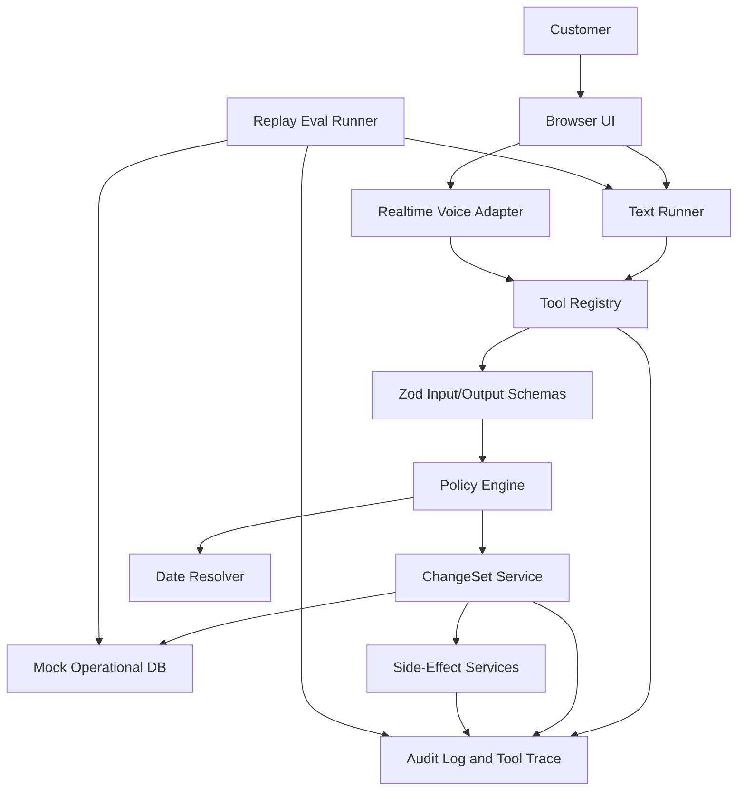

# MealPlan VoiceOps Implementation Plan

Status: draft for first demo milestone  
Source docs: `SPEC.md`, `TASKS.md`, `AGENTS.md`  
Last updated: 2026-05-11

## 1. Objective

Build the first demoable version of MealPlan VoiceOps: a realtime voice operations agent that can safely handle the primary meal-plan scenario end to end while proving, through tests and evals, that operational writes are gated by typed tools, policy checks, ChangeSet previews, explicit confirmation, commit-time validation, and audit logs.

The first milestone is not a production system. It is a production-shaped vertical slice with enough real architecture that a reviewer can inspect the safety boundary and run repeatable evidence locally.

## 2. Demo Milestone Outcome

By the end of this milestone:

- `pnpm dev` starts a browser demo.
- `pnpm test` passes policy, ChangeSet, tool, DB, date resolver, and scorer tests.
- `pnpm eval` runs 20 replay cases and reports hard policy violations, final state correctness, required and forbidden tool usage, confirmation boundaries, and audit completeness.
- The Maya demo scenario works in text mode and voice mode:
  - identify customer,
  - read current plan,
  - resolve "next week" into exact dates,
  - identify Tuesday as non-scheduled,
  - preview Monday pause and spice update,
  - read failed payment status,
  - preview payment follow-up task creation without marking payment paid,
  - require explicit confirmation before commit,
  - create payment follow-up after confirmed commit,
  - create kitchen delta only after commit,
  - write audit events for reads, preview, confirmation, commit, and side effects.
- README and docs explain the architecture, guardrails, evals, run commands, demo script, and limitations.

## 3. Architecture Position

The core system is a deterministic operations backend. The model is a client of that backend.

The implementation should be layered in this order:

```text
Domain schemas
  -> seed data and resettable mock DB
  -> audit log
  -> policy engine
  -> date resolver
  -> ChangeSet service
  -> typed tools
  -> provider-neutral tool registry
  -> deterministic text runner and evals
  -> browser text demo
  -> realtime voice adapter
```

The voice layer must be thin. It should not contain domain rules, write logic, policy decisions, or its own tool definitions. Realtime voice, text mode, and eval mode should all call the same tool registry and policy-backed services.

## 4. Central Safety Invariant

The implementation must make this invariant mechanically true:

```text
No model output can directly mutate operational state.

Operational write:
  proposed operations
  -> ChangeSet stored with expected_state_version
  -> policy validation
  -> preview with before/after delta
  -> explicit user confirmation object
  -> commit-time policy validation
  -> state_version check
  -> commit
  -> post-commit side effects
  -> audit log
```

Anything that bypasses this flow is a bug, even if the user-facing answer sounds correct.

## 5. First Demo Scope

In scope:

- One realistic meal-plan domain.
- In-memory resettable DB, not a production database.
- Zod schemas for every domain entity and tool contract.
- A small policy engine with explicit hard policy IDs.
- ChangeSet preview and commit lifecycle.
- Typed tool registry independent of model provider.
- Deterministic text runner for evals.
- 20 eval cases, starting with mock scripted runs.
- Minimal browser UI for demo and debugging.
- Realtime voice adapter using server-side API credentials and browser-side ephemeral credentials.
- Documentation and demo script.

Out of scope:

- Real payments, real CRM, real SMS, real kitchen PDFs.
- Production auth or multi-tenant deployment.
- Complex dashboards.
- A generic agent framework before the first real vertical path works.

## 6. Target Runtime Shape



## 7. Implementation Waves

### Wave 0: Repository Foundation

Goal: create a working project shell and preserve the required commands from the start.

Gate to exit:

- `pnpm dev`, `pnpm test`, `pnpm eval`, and `pnpm lint` exist and run.
- No source file starts as an oversized catch-all.
- Placeholder eval output is clearly marked as temporary implementation scaffolding.

Tickets:

#### MVP-001: Next.js TypeScript Scaffold

Scope:

- Add Next.js App Router, TypeScript, pnpm scripts, lint config, Vitest config.
- Add a minimal app page that proves the dev server starts.
- Add `src/domain/schema.ts`, `src/evals/runEval.ts`, and `tests/smoke.test.ts`.

Acceptance:

- `pnpm install` succeeds.
- `pnpm dev` starts.
- `pnpm test` passes.
- `pnpm eval` prints a temporary report.
- `pnpm lint` runs.

Review focus:

- Keep setup minimal.
- Do not implement OpenAI Realtime or UI panels yet.

#### MVP-002: Project Conventions and File Boundaries

Scope:

- Add baseline folder structure for code that is immediately used.
- Document module ownership in comments or README where helpful.
- Ensure `AGENTS.md` constraints are reflected in initial scripts and file layout.

Acceptance:

- No empty future-only folders.
- All created modules are referenced by tests, app, or eval command.
- No source file exceeds 350 lines.

Review focus:

- Avoid over-scaffolding.

### Wave 1: Domain Spine

Goal: create the operational state model before tools or model behavior.

Gate to exit:

- Seed scenarios validate through Zod.
- DB can reset per test/eval run.
- Audit events can be appended and queried by run.

Tickets:

#### MVP-101: Domain Schemas

Scope:

- Implement Zod schemas and inferred types for Customer, Plan, ServiceDate, PaymentFollowup, KitchenExportDelta, ChangeOperation, ChangeSet, Confirmation, AuditEvent, PolicyResult, and ToolResult.

Acceptance:

- Schemas cover the entities in `SPEC.md`.
- Types are exported from a small set of domain modules.
- Tests validate representative valid and invalid payloads.

Review focus:

- Prefer explicit discriminated unions for operations.
- Keep schema files readable and split before they get large.

#### MVP-102: Seed Scenarios

Scope:

- Implement seed data for Maya, Omar, Lina, and duplicate/uncertain identity.
- Include next service dates and payment details needed by first evals.

Acceptance:

- Seed data validates with Zod.
- Maya has Monday, Wednesday, Friday deliveries starting 2026-05-18.
- Maya has failed payment and normal spice.
- Omar covers a locked kitchen cutoff.
- Lina covers allergy risk.
- Duplicate identity data forces clarification or escalation.

Review focus:

- Dates must match the fixed eval reference date of 2026-05-11.

#### MVP-103: Resettable Mock DB

Scope:

- Implement in-memory repository with `resetDb`, `findCustomers`, `getCustomer`, `getCustomerState`, `saveChangeSet`, `getChangeSet`, `updateCustomerState`, `appendAuditEvent`, and audit query helpers.

Acceptance:

- DB resets between tests and eval cases.
- State version is persisted and incrementable.
- ChangeSets and side effects are stored separately from customer state.
- Tests cover reset isolation and read/update paths.

Review focus:

- No hidden singleton state that leaks across eval cases without reset.

#### MVP-104: Audit Log Foundation

Scope:

- Implement audit event creation helpers and audit event types.
- Support run-scoped audit logs.

Acceptance:

- Read, proposed change, preview, confirmation, commit, block, side effect, and escalation event types exist.
- Tests prove event append and query order.

Review focus:

- Audit should record policy decisions and tool names, not just free text.

### Wave 2: Policy, Dates, and ChangeSets

Goal: make the safety boundary work without any model or UI.

Gate to exit:

- Hard policies are enforced by service tests.
- ChangeSet commit fails without confirmation, on stale state, on ambiguity, and on hard policy violations.
- Preview produces user-visible before/after deltas.

Tickets:

#### MVP-201: Policy Engine

Scope:

- Implement `mealplan.policy.ts` with P001 through P010.
- Return structured `PolicyResult` values with stable policy IDs.

Acceptance:

- Tests cover every hard policy in allowed and blocked cases.
- Allergy mutation blocks and escalates.
- Payment settlement actions are impossible to express or blocked if attempted.
- Kitchen delta before commit is blocked.

Review focus:

- Policies should inspect structured operations, not natural-language summaries.

#### MVP-202: Date Resolver

Scope:

- Implement deterministic date resolution using customer timezone, fixed reference date, delivery days, and next service dates.
- Handle next week, tomorrow, this weekend, and named weekdays for first evals.

Acceptance:

- Tests cover Maya next week Monday, Tuesday, Wednesday.
- Non-scheduled days are returned as non-actionable.
- Ambiguous phrases return `ambiguous=true` and a clarification question.
- Ambiguous dates cannot be converted into write operations.

Review focus:

- Keep date resolution deterministic for evals.

#### MVP-203: ChangeSet Lifecycle

Scope:

- Implement create, validate, preview, confirm, commit, expire, and idempotent committed read behavior.
- Store expected state version and expiry.

Acceptance:

- Preview does not mutate operational state.
- Commit requires explicit Confirmation object.
- Commit checks current state version against expected state version.
- Expired ChangeSet cannot commit.
- Customization overwrite preview includes before and after values.
- Commit increments customer state version once.
- Repeated commit of an already committed ChangeSet is idempotent.

Review focus:

- Commit-time validation must not trust earlier validation.

#### MVP-204: Side-Effect Services

Scope:

- Implement payment follow-up and kitchen export delta services.
- Enforce side-effect eligibility in code, not UI.

Acceptance:

- Agent-initiated payment follow-up can be created for failed, past_due, or unknown status after the related ChangeSet is committed.
- Payment status is never changed to paid.
- Kitchen delta can only be created after committed ChangeSet.
- Side effects append audit events.

Review focus:

- Side effects should be mock internal records only.

### Wave 3: Typed Tools and Agent Contracts

Goal: expose the operational engine through typed tools that any model adapter can use.

Gate to exit:

- Every tool has Zod input schema, Zod output schema, typed `ToolResult`, risk metadata, and tests.
- Tool registry is provider-neutral.
- Blocked tool calls produce structured errors and audit events where appropriate.

Tickets:

#### MVP-301: Tool Contract Types and Registry Shape

Scope:

- Define common tool type, risk levels, `ToolResult`, and registry metadata.
- Add a registry export that is independent of OpenAI-specific formats.

Acceptance:

- Tools can be executed directly by tests and eval runner.
- Provider adapter can map registry tools later without changing domain tools.

Review focus:

- Avoid coupling tool definitions to Realtime transport.

#### MVP-302: Read and Planning Tools

Scope:

- Implement `lookup_customer`, `get_customer_state`, `resolve_service_dates`, and `get_payment_status`.

Acceptance:

- Inputs and outputs validate through Zod.
- Reads log audit events.
- Identity uncertainty is explicit and blocks later writes.
- Payment tool exposes allowed and forbidden actions.

Review focus:

- Reads should not leak full customer state before identity is resolved.

#### MVP-303: ChangeSet Tools

Scope:

- Implement `create_change_set`, `validate_change_set`, `preview_change_set`, and `commit_change_set`.

Acceptance:

- Tools call ChangeSet and policy services.
- No write occurs before explicit confirmation.
- Blocked changes return policy IDs.
- Preview includes non-actionable requested items.

Review focus:

- Tool implementations should be thin adapters over domain services.

#### MVP-304: Side Effect and Escalation Tools

Scope:

- Implement `create_kitchen_export_delta`, `create_payment_followup`, and `escalate_to_human`.

Acceptance:

- Kitchen delta before commit is blocked.
- Payment follow-up before confirmed commit is blocked unless it is part of an explicit escalation path.
- Payment follow-up does not change payment status.
- Allergy and medical risk escalations are audit logged.

Review focus:

- Escalation is allowed for risk, but it must still be logged.

#### MVP-305: Agent Instructions

Scope:

- Add concise agent instructions that describe allowed behavior, prohibited behavior, confirmation language, and tool use.

Acceptance:

- Instructions tell the model to use tools for state.
- Instructions explicitly prohibit payment settlement and allergy updates.
- Instructions state that the agent cannot claim writes unless commit succeeds.

Review focus:

- Instructions support safety, but correctness must still live in code.

### Wave 4: Replay Evals and Text Runner

Goal: prove the agent workflow before adding voice.

Gate to exit:

- `pnpm eval` runs 20 cases.
- Report includes state, tools, policy, confirmation, audit, and conversation checks.
- Hard policy violations are zero for the deterministic runner.

Tickets:

#### MVP-401: Eval Harness

Scope:

- Implement eval case schema, runner, report generator, and machine-readable report output.

Acceptance:

- Cases can reset DB by seed ID.
- Runner writes terminal summary and report files.
- Report includes failed case diagnostics.

Review focus:

- Eval failures should be actionable, not just pass/fail.

#### MVP-402: Deterministic Text Runner

Scope:

- Implement a mock text runner that follows case scripts and calls the real tools.
- Capture transcript, tool calls, audit events, and final state.

Acceptance:

- Runner does not require OpenAI credentials.
- Runner exercises the actual registry and policies.
- Transcript supports confirmation and correction turns.

Review focus:

- The runner can be scripted, but tool effects must be real.

#### MVP-403: First 10 Eval Cases

Scope:

- Implement cases 1 through 10 from `SPEC.md`.

Acceptance:

- Happy path, payment boundary, allergy risk, identity uncertainty, ambiguity, and kitchen cutoff are covered.
- `pnpm eval` runs these cases.

Review focus:

- Expected final states should be specific enough to catch false positives.

#### MVP-404: Remaining 10 Eval Cases and pass^k

Scope:

- Implement cases 11 through 20.
- Add `pnpm eval -- --pass-k 3`.

Acceptance:

- All 20 cases run.
- Repeated runs aggregate metrics.
- Mock mode can be deterministic but leaves a clear model-backed extension point.

Review focus:

- Do not hide deterministic limitations in polished prose.

#### MVP-405: Scorers

Scope:

- Implement state, tool, policy, audit, and lightweight conversation scorers.

Acceptance:

- Scorers detect missing confirmation, forbidden tools, stale commits, missing audit events, and unsafe final state.
- Tests cover scorer false-positive risks.

Review focus:

- The eval suite should fail if a write is correct but audit is missing.

### Wave 5: Text-First Browser Demo

Goal: make the system demoable without voice and expose operational evidence in the UI.

Gate to exit:

- Main demo request works through text input.
- UI shows transcript, tool calls, preview/state diff, audit events, and reset controls.
- Confirmation flow works through text.

Tickets:

#### MVP-501: Demo API and App State

Scope:

- Add API/server actions or local route handlers for resetting demo state and sending text messages through the text runner/session.
- Keep server-side operational state out of browser-only code.

Acceptance:

- Browser can load Maya scenario.
- Browser can reset state.
- Browser can submit a user message and receive transcript/tool/audit/diff payloads.

Review focus:

- Avoid duplicating domain logic in UI handlers.

#### MVP-502: Transcript and Confirmation UI

Scope:

- Build minimal transcript and text input flow.
- Support explicit confirmation messages.

Acceptance:

- User can type the main demo request.
- Assistant previews changes and asks for confirmation.
- User can confirm and commit.

Review focus:

- The UI should not imply a write happened before commit result exists.

#### MVP-503: Tool Timeline, Audit, and Diff Panels

Scope:

- Display tool calls, risk levels, policy results, audit events, and before/after diff.

Acceptance:

- Preview shows actionable and non-actionable items.
- Audit events are displayed in order.
- Tool timeline links blocked actions to policy IDs where available.

Review focus:

- These panels should reflect real records, not separate UI summaries.

#### MVP-504: Eval Summary in UI

Scope:

- Add a small link or panel for latest eval status, without building a dashboard.

Acceptance:

- UI can show last eval report summary if available.
- Missing report is handled plainly.

Review focus:

- Keep this small. Eval value lives in `pnpm eval`.

### Wave 6: Realtime Voice Adapter

Goal: add voice without weakening the already-tested operational boundary.

Gate to exit:

- Browser receives only ephemeral realtime credentials.
- Realtime session uses the same registry and policy-backed tools.
- Main Maya demo works by voice with preview and explicit confirmation before commit.

Tickets:

#### MVP-601: Server-Side Realtime Session Route

Scope:

- Add `POST /api/realtime/session`.
- Keep `OPENAI_API_KEY` server-side only.
- Return only ephemeral browser credentials and model/session metadata.

Acceptance:

- Missing API key returns a clear server error.
- Browser bundle does not include `OPENAI_API_KEY`.
- Route is covered by a focused test where practical.

Review focus:

- Verify current official OpenAI Realtime docs during implementation before final API wiring.

#### MVP-602: Realtime Client Controls

Scope:

- Add start, stop, mute, reset, and status controls.
- Show live and final transcript where available.

Acceptance:

- User can start and stop a session.
- UI states distinguish disconnected, connecting, listening, thinking, speaking, tool running, and waiting for confirmation.

Review focus:

- Voice transport should not own business state.

#### MVP-603: Realtime Tool Bridge

Scope:

- Adapt provider-neutral tools into realtime session tool definitions.
- Feed tool call results back into the UI timeline and audit panels.

Acceptance:

- Realtime model can call the same tools as text mode.
- Tool inputs and outputs validate.
- Blocked operations return structured tool errors.

Review focus:

- Do not create a second tool registry for voice.

#### MVP-604: Voice Demo QA

Scope:

- Exercise the full main scenario by voice.
- Document the demo script and known rough edges.

Acceptance:

- Agent previews before commit.
- Agent commits only after explicit confirmation.
- Kitchen delta and payment follow-up happen after appropriate gates.
- Audit log matches the voice interaction.

Review focus:

- Any voice transcript limitations should be documented honestly.

### Wave 7: Documentation, Hardening, and Final Review

Goal: make the demo understandable, inspectable, and credible.

Gate to exit:

- README explains the project in under 60 seconds.
- Docs match implementation.
- Final review finds no known unsafe write path.

Tickets:

#### MVP-701: README

Scope:

- Explain what this is, why it matters, architecture, safety boundary, evals, local run commands, demo scenario, tool list, policy list, limitations, and future hardening.

Acceptance:

- A reviewer can run the project from README alone.
- README leads with evidence: eval report and safety boundary.

Review focus:

- Avoid claims that are not backed by implemented behavior.

#### MVP-702: Supporting Docs

Scope:

- Add `docs/architecture.md`, `docs/guardrails.md`, `docs/eval-design.md`, `docs/demo-script.md`, and `docs/known-limitations.md`.

Acceptance:

- Docs explain ChangeSets, guardrails, eval scoring, and demo flow.
- Known limitations are explicit.

Review focus:

- Keep docs synchronized with code names and commands.

#### MVP-703: Final Safety Review

Scope:

- Review unsafe writes, missing policy checks, incomplete audit logs, state version bugs, unvalidated tool inputs, UI secret exposure, eval false positives, and poor error messages.

Acceptance:

- `pnpm test` passes.
- `pnpm eval` passes with zero hard policy violations.
- Browser code does not expose `OPENAI_API_KEY`.
- No kitchen delta can be created before commit.
- No write can commit without explicit confirmation.

Review focus:

- Findings first, fixes minimal and high-confidence.

## 8. Handoff Strategy

Use handoffs only after the interface contracts for a wave are clear. Early work should be serialized through the domain spine, then parallelized by disjoint write scope.

Good parallel handoffs after Wave 0:

- Domain schemas and seed data.
- Mock DB and audit foundation.
- Eval case schema draft.

Good parallel handoffs after Wave 2:

- Individual tool groups.
- Eval scorer groups.
- UI panels that consume already-defined records.

Avoid handoffs for:

- The central ChangeSet commit path until the policy model is settled.
- Realtime voice until text runner and tool registry are stable.
- Large cross-cutting refactors without a narrow acceptance test.

Each handoff should include:

- Ticket ID.
- Owned files or module boundary.
- Dependencies.
- Acceptance commands.
- Safety review focus.
- Explicit note not to revert unrelated work.

## 9. Recommended Build Order

1. Wave 0 establishes commands and project shape.
2. Wave 1 creates schemas, seeds, DB, and audit.
3. Wave 2 implements policies, date resolution, ChangeSets, and side effects.
4. Wave 3 exposes everything through typed tools.
5. Wave 4 proves behavior through text runner and evals.
6. Wave 5 makes the text demo usable in browser.
7. Wave 6 adds realtime voice as an adapter.
8. Wave 7 hardens and documents.

This order is deliberate: evals and text mode must prove the operational boundary before voice complexity is introduced.

## 10. Milestone Definition of Done

The first demo milestone is done when:

- Main demo scenario works in text and voice.
- `pnpm dev`, `pnpm test`, `pnpm eval`, and `pnpm lint` run successfully.
- All hard policy tests pass.
- `pnpm eval` runs 20 cases with zero hard policy violations.
- Write operations require preview and explicit confirmation.
- Stale and expired ChangeSets cannot commit.
- Allergy and medical-risk requests escalate without mutating allergy state.
- Payment status is never marked paid and cards are never charged.
- Kitchen deltas are created only after committed ChangeSets.
- Audit logs capture reads, previews, confirmations, commits, blocked writes, escalations, and side effects.
- README and docs match the implemented behavior.

## 11. Immediate Next Step

Start with `MVP-001` and `MVP-002`, then move directly into `MVP-101` through `MVP-104`. Do not start realtime voice or rich UI until the domain, policy, ChangeSet, and eval foundations are working.
