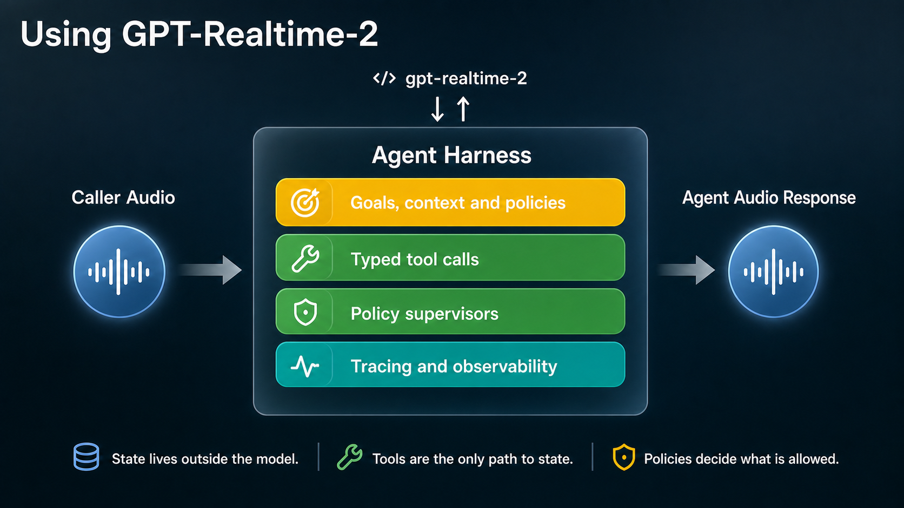

# MealPlan VoiceOps

> **The model can propose. The application decides.**

MealPlan VoiceOps is a realtime voice operations agent for a fictional meal-plan company.

It tests whether `gpt-realtime-2`, when placed inside a production-style operations harness, can safely handle contact-center work where mistakes affect deliveries, payments, and dietary safety.

The voice demo is the product surface. The harness is the engineering point.

```text
realtime speech-to-speech model
  + server-side tool execution
  + policy supervisor
  + safe state transitions
  + audit/eval evidence
```

---

## Problem

Phone support is not a clean chat transcript.

Callers interrupt, self-correct, use vague dates, speak from noisy environments, and mix several requests into one sentence. A contact-center agent has to do three things at once:

1. **Hear correctly** despite imperfect audio.
2. **Reason correctly** through messy, non-linear requests.
3. **Act correctly** against business systems and policies.

For a meal-plan company, mistakes are not cosmetic. A bad action can mean a wrong delivery, a missed allergy constraint, or a payment error.


---

## Approach

Traditional voice agents often use a chained pipeline:

```text
caller audio -> STT -> text model -> tools -> text response -> TTS -> caller
```

That pattern is valid, and good systems still wrap it in a harness for tools, policy, state, evidence, and evals.

MealPlan VoiceOps explores a newer shape: a harness around a native realtime speech-to-speech model.

The question is not whether speech-to-speech removes the need for a harness. It does not. The question is whether the live conversation loop becomes simpler and more coherent when hearing, reasoning, tool requests, and speech live inside one realtime model, while the harness still owns state, policy, evidence, and authority.

| Dimension | Chained pipeline harness | Speech-to-speech harness | Why it matters |
|---|---|---|---|
| Conversation latency | Audio moves through STT, text reasoning, tools, text response, and TTS | One realtime session handles the live conversation loop | Lower delay makes phone support feel more natural |
| Context continuity | The transcript becomes the main handoff between components | Speech, reasoning, tool requests, and response generation share one model context | Fewer handoffs can reduce mismatch between what was heard, reasoned, and said |
| Failure attribution | Bugs can come from STT, text reasoning, TTS, orchestration, tools, or glue code | Fewer translation boundaries make failures easier to localize | Contact-center QA depends on knowing what failed and why |
| Interaction ownership | Tone, hesitation, interruption, and speech timing are split across components | The same realtime model handles spoken cues, reasoning, and spoken response | This can change how systems handle empathy, clarification, interruption, and escalation |

Meal plans are a useful stress test because one caller request can involve:

- vague dates like “next week”,
- delivery schedules,
- kitchen cutoff windows,
- meal preferences,
- allergies,
- payment status,
- follow-up tasks,
- explicit confirmation before writes.

Example caller request:

> “Hi, I’m traveling next week. Can you pause Monday and Tuesday, keep Wednesday, make my chicken meals spicy, and check if my card failed yesterday?”

The system should identify the customer, read the current plan, resolve dates, detect that Tuesday is not scheduled, check payment status, preview safe changes, ask for confirmation, commit only after server-captured confirmation, and write audit/eval evidence.

---

## The System




| Component | Role |
|---|---|
| Browser | Captures caller audio, plays agent voice, displays evidence |
| `gpt-realtime-2` | Listens, reasons, speaks, and requests tools |
| Server sideband | Owns trusted tool execution and business control |
| Typed tools | Customer lookup, state reads, date resolution, previews, commits, escalations |
| Policy supervisor | Blocks unsafe actions such as allergy edits, payment settlement, ambiguous dates, or unconfirmed writes |
| Domain state | Mock customers, plans, service dates, payments, pending changes, confirmations, audit events |
| Evidence layer | Transcripts, traces, tool calls, policy decisions, audio artifacts, final state, and reports |

Architecture, simplified:

```text
Caller
  -> Browser voice console
  -> OpenAI Realtime session
  <-> Server sideband control
  -> Typed tool registry
  -> Domain services
  -> Policy supervisor
  -> Mock DB + audit/evidence
```

A typical call flow:

```text
1. Caller speaks a messy request.
2. Model requests customer lookup and state reads.
3. Server tools resolve dates, payment status, and current plan state.
4. The system builds a pending preview.
5. Policy blocks unsafe or ambiguous operations.
6. Caller explicitly confirms.
7. Server creates the confirmation record.
8. The change is revalidated and committed.
9. Internal side effects are created.
10. Audit and eval evidence are written.
```

Detailed docs are listed at the end.

---

## How To Run

Install:

```bash
pnpm install
```

Run the browser demo:

```bash
pnpm dev
```

Requires:

```bash
OPENAI_API_KEY=...
OPENAI_REALTIME_MODEL=gpt-realtime-2
```

Run tests:

```bash
pnpm test
pnpm lint
```

Run scripted safety evals:

```bash
pnpm eval
pnpm eval -- --pass-k 3
```

No OpenAI credentials required.

Run realtime audio evals:

```bash
pnpm eval:realtime -- --stage crawl
pnpm eval:realtime -- --stage walk
pnpm eval:realtime -- --stage walk --walk-profile walk_uncertain_noise_v1
```

Realtime evals require server-side OpenAI credentials.

---

## Status

### Implemented

- realtime browser demo,
- server-side sideband tool execution,
- typed domain schemas and tool registry,
- policy supervisor with stable hard-policy IDs,
- pending change preview and confirmation-gated commit flow,
- server-created confirmation records,
- audit logs and evidence panels,
- scripted safety evals with 20 golden cases,
- realtime Crawl and Walk eval harnesses,
- generated audio artifacts, traces, reports, and final-state checks.

### Planned

- multi-turn Run evals,
- richer interruption and overlap scoring,
- cached stable audio fixtures for gating,
- improved confirmation and preview UX,
- production persistence, auth, and human-handoff hardening.

### Limitations

- This is a production-shaped demo, not a production deployment.
- The DB and evidence store are local/in-memory.
- There are no real payments, CRM, SMS, kitchen PDFs, auth, or human handoff queue.
- Realtime evals require API credits.
- Audio fixtures are not yet stable CI gating assets.
- Out-of-band transcription is diagnostic only, not an operational source of truth.

---

## Docs

- [`SPEC.md`](SPEC.md): product and engineering spec
- [`AGENTS.md`](AGENTS.md): repo rules and safety constraints
- [`docs/architecture.md`](docs/architecture.md): architecture and runtime boundaries
- [`docs/guardrails.md`](docs/guardrails.md): policies, ChangeSets, and confirmation rules
- [`docs/eval-design.md`](docs/eval-design.md): scripted and realtime eval strategy
- [`docs/demo-script.md`](docs/demo-script.md): browser demo walkthrough
