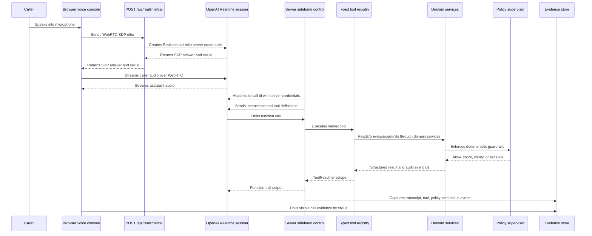

# MealPlan VoiceOps Specification

**Version:** 1.0
**Date:** 2026-05-16
**Audience:** technical collaborators, coding agents, reviewers
**Purpose:** product and system requirements

This document defines what MealPlan VoiceOps must do and which safety guarantees it must preserve. It is not an implementation plan.

Reviewer-facing narrative belongs in `README.md`. Agent working rules belong in `AGENTS.md`. Implementation sequencing is intentionally kept out of this public spec.

## Background Problem

Contact-center phone support is operationally messy.

Callers may interrupt, self-correct, speak from noisy environments, use vague dates, change their mind, or combine several requests in one sentence. A support agent must listen, reason, and act while respecting business rules.

For a meal-plan subscription company, mistakes are not just conversational:

- a wrong delivery change can affect fulfillment,
- a payment mistake can affect revenue,
- an allergy mistake can create safety risk,
- an ambiguous date can mutate the wrong service day,
- a stale preview can commit a change against outdated state.

MealPlan VoiceOps must demonstrate a safe realtime voice operations flow for this kind of support scenario.

## Scope and Non-Goals

### In Scope

MealPlan VoiceOps MUST support a production-shaped demo of a meal-plan contact-center agent that can:

- run a realtime browser voice session,
- identify or clarify the customer,
- read current customer state,
- resolve service dates from natural language,
- preview valid meal-plan changes,
- block unsafe or ambiguous operations,
- request explicit confirmation before risky writes,
- commit confirmed ChangeSets,
- create internal side effects only after commit,
- write audit and evidence records,
- run deterministic scripted evals,
- run credential-gated realtime audio evals.

### Non-Goals

MealPlan VoiceOps MUST NOT implement:

- real payment processing,
- card charging,
- real CRM integration,
- real SMS, WhatsApp, or email delivery,
- production authentication,
- production persistence,
- multi-tenant deployment,
- real kitchen PDF generation,
- a full human-agent queue.

These may be discussed as future production hardening, but they are not project requirements.

## Core Approach

MealPlan VoiceOps is built around four architectural decisions.

### 1. Native Realtime Speech-to-Speech Loop

The live demo SHOULD use a native realtime speech-to-speech session for caller audio, model reasoning, tool requests, and spoken response.

This is required to evaluate contact-center behavior as a voice interaction, not only as a transcript workflow.

### 2. Server-Side Sideband Control

Tool execution MUST be owned by the application server through a trusted sideband control path.

The browser MUST NOT receive API keys, execute operational tools, or mutate domain state.

The sideband controller MUST:

- attach realtime instructions and tool definitions,
- receive function calls from the realtime session,
- execute tools through the shared registry,
- return structured tool results,
- capture transcript, tool, policy, and status evidence,
- de-duplicate repeated realtime function-call events.

### 3. Deterministic Policy Supervisor

Operational authority MUST live in deterministic application code.

Policies MUST be enforced by structured tool inputs, domain services, and commit-time validation. Prompt instructions may guide behavior, but they MUST NOT be the only enforcement mechanism for unsafe operations.

The policy supervisor MUST block or escalate unsafe operations even if the model asks for them.

### 4. ChangeSet Lifecycle for Risky Writes

Risky writes MUST be represented as pending ChangeSets before they can affect operational state.

The required write lifecycle is:

```text
read state
-> create pending ChangeSet
-> validate policy
-> preview before/after delta
-> capture explicit user confirmation
-> create server confirmation record
-> revalidate policy and state_version
-> commit
-> create internal side effects
-> write audit events
```

Until commit succeeds, customer operational state MUST NOT change.

## Platform and Stack Requirements

MealPlan VoiceOps MUST use a TypeScript-first stack.

Required platform choices:

| Area | Requirement |
|---|---|
| Web runtime | The browser demo MUST use Next.js App Router, React, and TypeScript. |
| Live voice runtime | The live browser path MUST use OpenAI [Realtime API](https://developers.openai.com/api/docs/guides/realtime) with `gpt-realtime-2` over [WebRTC](https://developers.openai.com/api/docs/guides/realtime-webrtc). |
| Server control path | Trusted tool execution MUST use [server-side sideband control](https://developers.openai.com/api/docs/guides/realtime-server-controls). |
| Realtime eval runner | Automated realtime smoke/eval runs MAY use the OpenAI [Agents SDK voice-agent primitives](https://developers.openai.com/api/docs/guides/voice-agents) as a harness wrapper, but MUST preserve the same tool, policy, audit, and evidence contracts as the live Realtime API path. |
| Tool and state contracts | Tool inputs, tool outputs, domain entities, eval cases, and evidence payloads MUST be validated with Zod or equivalent typed schemas. |
| Realtime case format | Realtime eval cases MAY use YAML for readable case definitions. |
| Tests and evals | Unit/integration tests SHOULD use Vitest. Eval runners SHOULD be executable TypeScript scripts. |
| Secrets | `OPENAI_API_KEY` MUST remain server-side and MUST NOT be exposed to browser code. |

Implementation MAY change libraries in the future, but it MUST preserve the runtime boundaries and safety guarantees defined in this spec.

### Realtime API vs Agents SDK Decision

The live browser path MUST use the OpenAI [Realtime API](https://developers.openai.com/api/docs/guides/realtime) directly unless this decision is explicitly revisited.

This is not because the OpenAI [Agents SDK](https://developers.openai.com/api/docs/libraries#use-the-agents-sdk) lacks voice-agent capabilities. The SDK is a valid browser voice-agent path and can provide code-first orchestration for agents, tools, guardrails, handoffs, and tracing.

MealPlan VoiceOps uses the lower-level Realtime API for the live browser path because the project needs direct ownership of the session boundary, sideband connection, raw event stream, and evidence model.

| Area | Agents SDK support | Why the live path uses the lower-level Realtime API |
|---|---|---|
| Server-side tool authority | The SDK can orchestrate tools and guardrails. | The application needs explicit ownership of the sideband call ID, WebSocket, tool execution, idempotency, confirmation records, and audit writes. |
| Evidence and debugging | SDK tracing is useful. | The project needs its own evidence store for raw realtime events, transcript fragments, tool calls, sideband status, final state, audio artifacts, and eval reports. |
| Architecture clarity | The SDK can express a voice agent more compactly. | The direct API path makes the trust boundary visible: browser handles voice, server handles tools, policy, state, confirmations, and audit. |
| Provider-neutral domain layer | The SDK can be used carefully with external domain services. | The lower-level path reduces the chance that tool, policy, or ChangeSet semantics become coupled to SDK-specific agent objects. |

Automated realtime smoke/eval runners MAY use OpenAI [Agents SDK realtime primitives](https://developers.openai.com/api/docs/guides/voice-agents) as a harness wrapper. They MUST still call the same typed tool registry and preserve the same policy, audit, confirmation, and evidence contracts as the live browser path.

## Architecture

MealPlan VoiceOps MUST separate the conversation surface from operational authority.

The required runtime components are:

| Component | Requirement |
|---|---|
| Browser voice console | Captures microphone audio, plays assistant audio, and displays evidence. |
| Realtime model session | Handles realtime speech, reasoning, and tool requests. |
| Server sideband control | Owns trusted tool execution and session supervision. |
| Typed tool registry | Exposes provider-neutral operational tools with schemas and typed results. |
| Domain services | Own customer state, date resolution, ChangeSets, confirmations, side effects, and audit. |
| Policy supervisor | Enforces hard business rules in code. |
| Evidence layer | Captures transcripts, tool calls, policy results, traces, final state, and reports. |
| Eval harnesses | Score scripted and realtime behavior against expected outcomes. |

Browser sessions, scripted evals, realtime evals, and smoke runners MUST reuse the same tool registry and domain policy layer.

### Browser and Sideband Runtime Flow

The browser and server MUST connect to the same realtime session through separate control paths.



The browser MAY display evidence, but operational truth MUST come from tool results, domain state, policy decisions, confirmations, and audit events.

## Agents

The primary agent is a MealPlan support voice agent.

The agent MUST:

- speak as a meal-plan support representative,
- ask concise clarifying questions when required information is missing,
- identify or clarify the customer before account-specific writes,
- use tools for operational facts,
- explain previews before requesting confirmation,
- distinguish payment follow-up from payment settlement,
- escalate medical or allergy-risk requests,
- keep voice responses concise.

The agent MUST NOT:

- claim an operation completed before a tool succeeds,
- invent tool results,
- claim it has permission to mutate state,
- mark a payment as paid,
- charge a card,
- modify allergies,
- rely on memory or transcript text for operational correctness.

### Unclear Audio

If caller audio is unclear, noisy, ambiguous, or partially cut off, the agent SHOULD ask for clarification instead of guessing.

Unclear audio handling is a model behavior requirement. Operational safety MUST still be enforced by server-side policies.

### Confirmation Behavior

The agent MAY ask the caller to confirm a preview.

The agent MUST NOT create its own write authority. Confirmation authority belongs to the server-created confirmation record.

## Tools

All operational tools MUST be typed and validated.

Every tool MUST define:

- Zod input schema,
- Zod output schema,
- typed result envelope,
- risk category,
- error shape,
- audit behavior where appropriate.

Tool risk categories SHOULD include:

- `read`,
- `preview`,
- `write`,
- `side_effect`,
- `escalation`.

Read tools MAY run when required fields are available.

Preview tools MAY create pending state, but MUST NOT mutate final customer state.

Write tools MUST require confirmed identity, a valid pending ChangeSet when applicable, policy pass, explicit confirmation, and state-version validation.

Side-effect tools MUST run only after the state transition that justifies them, unless the side effect is escalation-only.

### Agent-Callable Tool Inventory

The realtime agent SHOULD receive only the model-facing operational tools.

| Tool | Risk | Requirement |
|---|---|---|
| `lookup_customer` | `read` | Find customer candidates from customer ID, name, phone, or other allowed lookup hint. Must return uncertainty when identity is not exact. |
| `get_customer_state` | `read` | Read the confirmed customer's plan, service dates, allergies, preferences, payment summary, and state version. |
| `resolve_service_dates` | `read` | Convert caller date language into exact service dates using customer state and a fixed reference date. Must flag ambiguity and non-scheduled days. |
| `get_payment_status` | `read` | Read payment status for follow-up planning only. Must never settle, charge, or mark payment paid. |
| `create_change_set` | `preview` | Create a pending ChangeSet for valid proposed operations. Must require confirmed identity and policy validation. |
| `validate_change_set` | `preview` | Re-run policy validation for a pending ChangeSet. Must not mutate customer state. |
| `preview_change_set` | `preview` | Produce before/after deltas and the confirmation challenge for a pending ChangeSet. Must not mutate customer state. |
| `capture_confirmation` | `write` | Create the server confirmation record from the current explicit user turn for the same ChangeSet. |
| `commit_change_set` | `write` | Commit a previewed ChangeSet only with valid server confirmation, policy pass, and state-version match. |
| `escalate_to_human` | `escalation` | Create an audited human escalation without mutating customer state. |

Internal side effects such as kitchen deltas and payment follow-up materialization MUST NOT be exposed as standalone model-facing tools. They are created by domain services after the committed ChangeSet justifies them.

## Operational State

The system MUST model enough state to evaluate realistic meal-plan operations.

Required state objects:

| State object | Requirement |
|---|---|
| Customer | Identity, contact hints, allergies, preferences, payment status, and `state_version`. |
| Plan | Subscription plan and delivery cadence. |
| ServiceDate | Upcoming delivery date, day of week, status, and kitchen lock state. |
| ChangeSet | Pending proposed changes, preview data, expiry, and expected `state_version`. |
| Confirmation | Server-created record binding an explicit confirmation to a specific ChangeSet. |
| PaymentFollowup | Internal task for failed or unknown payment status. |
| KitchenExportDelta | Internal side effect created after committed meal changes. |
| AuditEvent | Record of reads, previews, confirmations, commits, blocks, escalations, and side effects. |
| RealtimeEvidence | Live and post-run evidence from realtime sessions. |

The model MUST access operational state only through tools.

State mutation MUST happen only through domain services.

## Guardrails

Guardrails are hard requirements enforced by application code.

The system MUST enforce these policies:

| Policy | Requirement |
|---|---|
| Identity required before writes | Account-specific writes, ChangeSet commits, and side effects require confirmed identity. |
| Allergy mutation blocked | The agent must never add, remove, or weaken allergy records. Allergy-risk requests require escalation. |
| Payment settlement blocked | The agent must never charge a card or mark a payment as paid. |
| Ambiguous dates blocked | Date-based writes require exact resolved service dates. |
| Confirmation required | Risky writes require preview plus explicit server-captured confirmation. |
| Kitchen delta after commit | Kitchen deltas must not exist before the related ChangeSet commits. |
| State version checked | Commits must fail if current state differs from previewed state. |
| Customization delta shown | Preference changes must show before/after values before confirmation. |
| Kitchen lock respected | Locked service dates must not be silently changed. |
| Expired ChangeSet blocked | Expired ChangeSets cannot commit. |

Each hard policy SHOULD have a stable policy identifier in code and eval output.

## Evals

MealPlan VoiceOps MUST include two eval layers.

### Scripted Safety Evals

Scripted evals MUST run without OpenAI credentials.

They MUST verify:

- tool schema validation,
- policy blocks,
- ChangeSet preview and commit behavior,
- confirmation boundary,
- final DB state,
- side-effect creation,
- audit completeness,
- idempotency where applicable.

Scripted evals do not prove model tool selection. They prove the backend safety boundary.

### Realtime Audio Evals

Realtime evals MUST exercise the actual realtime agent.

They SHOULD follow a staged progression:

- `crawl`: clean generated audio and simple flows,
- `walk`: degraded audio and clarification behavior,
- `run`: multi-turn calls with corrections, interruptions, tool failures, and stale state.

Realtime eval reports SHOULD include:

- input case metadata,
- audio artifact metadata,
- transcript fragments,
- tool calls,
- policy decisions,
- final state checks,
- audit checks,
- trace or event timeline,
- pass/fail diagnostics.

Realtime transcripts are diagnostic evidence. They MUST NOT be treated as operational confirmation authority.

## Acceptance Criteria

The project is acceptable when:

1. The browser voice demo can start a realtime session and attach server-side control.
2. Tool calls execute server-side through the shared registry.
3. The agent can perform the main meal-plan change preview flow.
4. Risky writes require preview and explicit server-captured confirmation.
5. Hard policies block allergy mutation, payment settlement, ambiguous dates, stale commits, expired ChangeSets, and premature kitchen deltas.
6. Scripted evals pass for the golden safety cases.
7. Realtime crawl evals can run against clean generated audio.
8. Realtime walk evals can run against degraded audio profiles.
9. Audit and evidence records explain what happened in each run.
10. Documentation clearly states implemented behavior, limitations, and non-goals.
