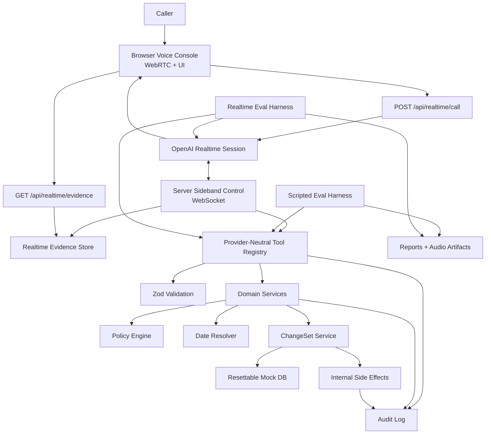

# Architecture

MealPlan VoiceOps separates conversation from operational authority.

The realtime model can talk to callers and request tools. The server owns tool execution, policies, state changes, side effects, evidence, and audit logs.


## Runtime Shape



## Browser Realtime Flow

1. The browser asks for microphone permission and creates a WebRTC SDP offer.
2. `POST /api/realtime/call` exchanges the offer with OpenAI from server code.
3. The browser receives the SDP answer and the `rtc_...` call id.
4. The browser streams microphone audio to the Realtime session and plays assistant audio.
5. The server opens a sideband WebSocket to the same Realtime call.
6. The server attaches the MealPlan instructions and tools from trusted code.
7. Realtime function calls are received on the sideband connection.
8. The server executes each call through the provider-neutral tool registry.
9. Tool results are sent back into the Realtime session.
10. Browser UI polls evidence by `call_id` to display transcripts, tool calls, and state.

The browser never receives `OPENAI_API_KEY`, domain write tools, direct DB access, or policy logic.

## Sideband Control

The sideband controller is the trusted bridge between the model and the operations backend.

Responsibilities:

- attach prompt and tool definitions to the Realtime session,
- de-duplicate Realtime function calls by `call_id`,
- execute tools through the same registry used by evals,
- return structured tool outputs to the session,
- capture transcript and tool evidence,
- keep cleanup idempotent when a call ends or fails.

## Module Boundaries

```text
src/app/
  Browser demo UI, App Router routes, evidence panels, transcript rendering.

src/browser/
  WebRTC controller, data-channel parsing, browser realtime events, mic constraints.

src/agent/
  Realtime prompt, browser session config, sideband control, SDK runner,
  audio streaming, tracing, realtime tool adapter.

src/tools/
  Provider-neutral tool registry, Zod schemas, tool context, tool results.

src/domain/
  Domain schemas, seed data, resettable DB, policies, date resolver,
  ChangeSet lifecycle, preview logic, internal side effects.

src/audit/
  Audit event creation and querying.

src/evidence/
  Live browser-session evidence store and event builders.

src/evals/
  Scripted cases, realtime cases, scorers, reports, TTS input generation,
  audio artifacts, Walk audio profiles.
```

## Design Constraints

- Domain logic must not live in UI code.
- Browser code must not execute business tools.
- Realtime-specific code must not define a separate policy system.
- Scripted evals, realtime evals, and browser sessions must share the same tool registry.
- Operational state changes must happen through ChangeSets.
