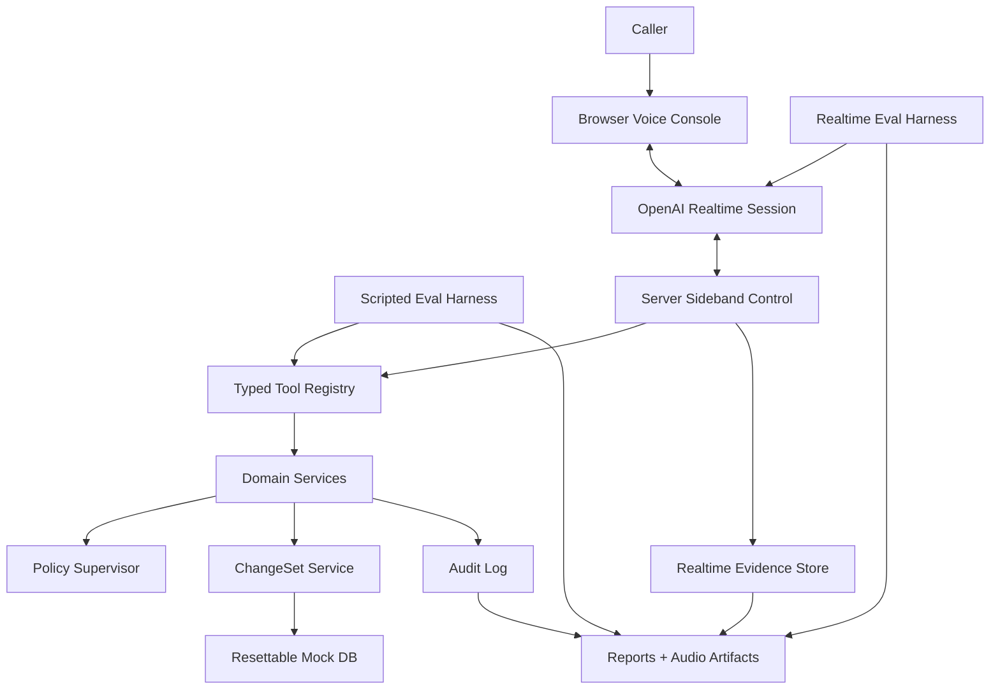
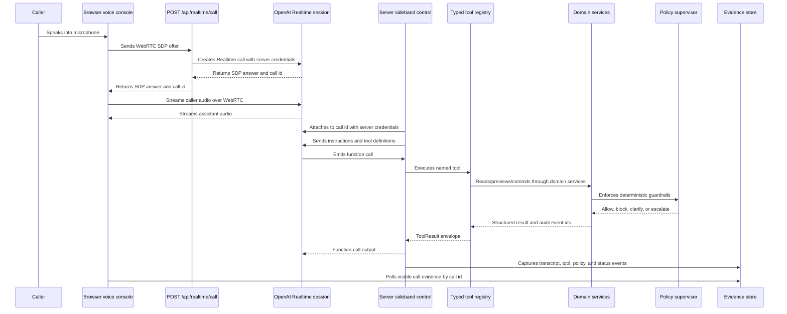

# Architecture

MealPlan VoiceOps separates realtime conversation from operational authority.

The model can listen, reason, speak, and request tools. The application owns state, policy, confirmations, side effects, audit, and evidence.


## Architecture Goals

This architecture is designed to make a realtime contact-center agent inspectable and safe:

- keep secrets and business logic on the server,
- expose state only through typed tools,
- enforce policy in deterministic code,
- route risky writes through ChangeSets,
- capture enough evidence to debug model, tool, policy, and audio behavior,
- reuse the same domain layer across browser demo, scripted evals, and realtime evals.

The live browser path intentionally uses the OpenAI [Realtime API](https://developers.openai.com/api/docs/guides/realtime) directly with browser [WebRTC](https://developers.openai.com/api/docs/guides/realtime-webrtc) and server-side [sideband control](https://developers.openai.com/api/docs/guides/realtime-server-controls). The SDK tradeoff is documented in [SPEC.md](../SPEC.md).

## Execution Paths

There are three important paths through the same backend.

| Path | Purpose | Model involved? | Shared backend? |
|---|---|---:|---:|
| Browser demo | Human speaks to the realtime voice agent in the UI. | Yes | Yes |
| Scripted evals | Deterministic safety baseline for tools, policy, state, and audit. | No | Yes |
| Realtime evals | Audio replay against the actual realtime agent. | Yes | Yes |

All three paths converge on the same typed tool registry, domain services, policy supervisor, ChangeSet lifecycle, and audit layer.



## Live Browser Flow

The browser and server connect to the same realtime session through separate control paths.



The browser never receives `OPENAI_API_KEY`, domain write tools, direct DB access, or policy logic.

## Live Audio Configuration

The browser demo uses the browser as the audio surface and the Realtime API as the live turn-taking layer.

| Concern | Current configuration | Reason |
|---|---|---|
| Browser capture cleanup | `autoGainControl`, `echoCancellation`, and `noiseSuppression` are requested with `{ ideal: true }`. | Improve local microphone quality before audio reaches the realtime session. This is browser and device dependent, not a custom DSP filter. |
| Browser audio packetization | No app-level chunk size is configured for the live browser path. WebRTC handles audio packetization between the browser and the Realtime session. | Keep the browser path close to a real low-latency voice call instead of manually batching microphone bytes. |
| OpenAI input noise reduction | Defaults to `far_field`. Override with `MEALPLAN_REALTIME_NOISE_REDUCTION=near_field`, `far_field`, `off`, `none`, or `disabled`. | Tune Realtime API input cleanup without changing code. |
| Turn detection / VAD | The live browser path relies on the OpenAI Realtime API default VAD. The API default is `server_vad`; the code does not override `turn_detection` for browser calls. | Keep live phone-style turn taking natural while avoiding a custom client-side speech detector. |
| Input transcription | `gpt-4o-mini-transcribe`, language `en`. | Provide visible transcript evidence for debugging and the demo UI. Transcript text is not write authority. |
| Output voice | `alloy`. | Keep the demo voice stable across sessions. |
| Reasoning effort | `low`. | Balance responsiveness with basic operational reasoning. |
| Parallel tool calls | `false`. | Keep tool execution ordered and easier to audit in this safety-sensitive demo. |
| Safety identifier | `mealplan-voiceops-local-demo`. | Attach stable tracing context to local browser sessions. |

The browser audio settings reduce local echo and room noise, but they do not eliminate all leakage. Headphones are still recommended during live testing.

Runtime defaults for model, voice, input transcription, browser audio cleanup, API noise reduction, eval replay, and Walk profiles are centralized in `src/realtime/config/runtimeConfig.ts`.

If we need to tune live turn detection later, the Realtime API exposes `turn_detection` settings. For `server_vad`, the relevant knobs are `threshold`, `prefix_padding_ms`, `silence_duration_ms`, `create_response`, and `interrupt_response`. The API also supports `semantic_vad` with an `eagerness` setting. MealPlan VoiceOps currently documents this as an intentional default, not a tuned VAD profile.

## Trust Boundary

| Layer | Trusted to do | Not trusted to do |
|---|---|---|
| Browser | Capture microphone audio, play assistant audio, display evidence. | Execute tools, enforce policy, validate confirmations, mutate state. |
| Realtime model | Converse, reason, request tools, explain previews and outcomes. | Invent operational facts, authorize itself, bypass tool results. |
| Server sideband | Attach instructions/tools, receive function calls, execute registry tools, return results. | Create a separate policy path or hidden write path. |
| Tool registry | Validate tool input/output, route to domain services, normalize tool results. | Encode UI-specific behavior or model-specific policy shortcuts. |
| Domain services | Own state reads, date resolution, ChangeSets, side effects, policy checks, audit. | Depend on realtime transport details. |
| Evidence/evals | Record and score what happened. | Become operational authority for writes. |

The model is trusted to propose. The application is trusted to enforce.

## Sideband Control

The sideband controller is the trusted bridge between the realtime model and the operations backend.

Responsibilities:

- attach instructions and tool definitions to the Realtime session,
- keep tool execution server-side,
- de-duplicate Realtime function calls by `call_id`,
- execute tools through the shared registry,
- return structured tool outputs to the session,
- apply tool results to server-held session state,
- capture transcript, tool, policy, and status evidence,
- clean up idempotently when a call ends or fails.

The sideband controller must not contain domain rules. It should be orchestration glue around the shared registry and domain layer.

## Tool and State Flow

Operational tools follow the same shape in every runtime:

```text
model or eval requests tool
-> Zod input validation
-> typed tool context
-> domain service
-> policy supervisor
-> structured ToolResult
-> audit event ids
-> realtime/eval evidence
```

Reads may return customer, plan, date, or payment state. Risky writes must route through the ChangeSet lifecycle:

```text
read state
-> create pending ChangeSet
-> validate policy
-> preview before/after delta
-> capture explicit user confirmation
-> create server confirmation record
-> revalidate policy and state_version
-> commit
-> create internal side effects
-> write audit events
```

Until commit succeeds, customer operational state does not change.

## Evidence Surfaces

The project keeps multiple evidence surfaces because each answers a different debugging question.

| Evidence surface | Answers |
|---|---|
| Realtime evidence store | What happened during a live browser call? |
| Audit log | Which reads, previews, blocks, commits, confirmations, and side effects happened? |
| Realtime traces | Which realtime events, transcripts, and tool calls were observed? |
| Eval reports | Did the run satisfy expected tool, policy, final-state, and conversation criteria? |
| Audio artifacts | What exact clean or degraded audio was sent during realtime evals? |

Realtime transcripts are diagnostic evidence. They are not operational write authority.

## Module Boundaries

```text
.
├── src/
│   ├── app/
│   │   └── Next.js App Router pages and API handlers.
│   ├── features/
│   │   └── voice-console/
│   │       ├── components/  UI rendering and icons.
│   │       ├── hooks/       React integration with realtime and evidence polling.
│   │       ├── state/       Local console state transitions.
│   │       ├── evidence/    Transcript and tool-evidence formatting.
│   │       └── styles/      Feature CSS.
│   ├── realtime/
│   │   ├── browser/         WebRTC controller, data channel, mic constraints.
│   │   ├── config/          Realtime instructions, runtime defaults, tools, transcription prompt.
│   │   ├── server/          Realtime call setup, sideband control, tracing.
│   │   └── runner/          Smoke/eval runner, audio streaming, traces.
│   ├── tools/               Provider-neutral typed tool registry.
│   ├── domain/              Schemas, mock DB, policies, dates, ChangeSets.
│   ├── audit/               Audit event creation and querying.
│   ├── evidence/            Realtime evidence store and event builders.
│   └── evals/               Scripted/realtime cases, scorers, reports, audio.
├── docs/                    Architecture, guardrails, eval design, demo script.
├── tests/                   Unit, integration, UI, realtime, and eval tests.
├── README.md                Reviewer-facing overview and run commands.
├── SPEC.md                  Product and system requirements.
└── AGENTS.md                Coding-agent onboarding and working rules.
```

## Design Constraints

- Domain logic must not live in UI code.
- Browser code must not execute business tools.
- Realtime-specific code must not define a separate policy system.
- Scripted evals, realtime evals, and browser sessions must share the same tool registry.
- Operational writes must happen through ChangeSets.
- Confirmations must be server-created records, not model assertions.
- Evidence must be useful enough to debug failures, but must not become write authority.
