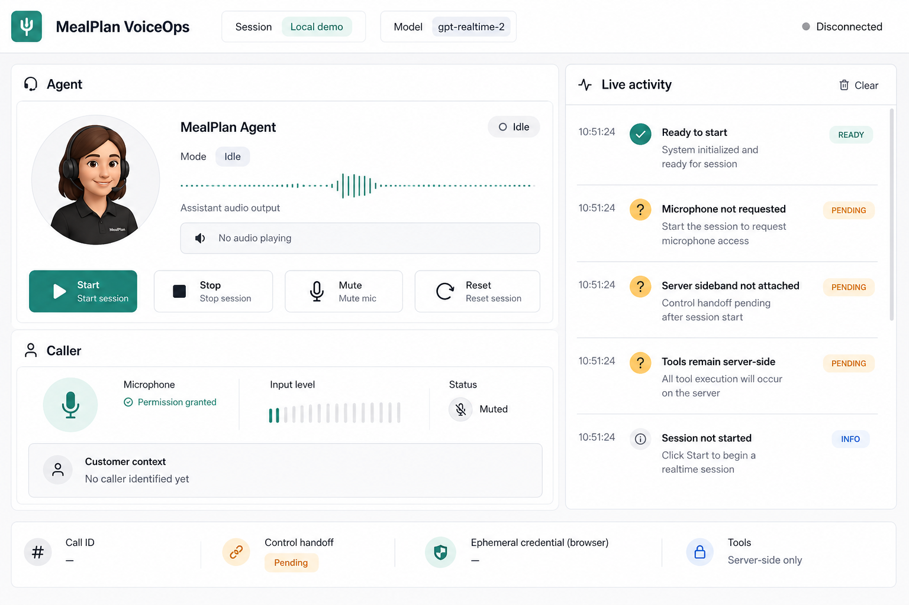

# CODS-160 Voice Console Mockup

This is the visual reference for `CODS-160: Browser voice controls`.



## Implementation Intent

- Build an operational call console, not a landing page.
- Left side: agent panel, caller panel, voice controls, and customer context placeholder.
- Right side: dynamic live activity feed, not a fixed linear state checklist.
- Bottom strip: compact technical state such as call ID, control handoff, ephemeral credential, and server-side tools.
- Keep transcript, tool timeline, audit log, and before/after diff out of scope for this ticket. Those belong to `CODS-161`.
- Browser code owns media/session UX only. Domain tools and writes remain server-side.

## Image Generation Prompt

```text
High-fidelity desktop web app UI mockup for “MealPlan VoiceOps”, an operational realtime voice agent console for a meal-plan subscription contact center. Light professional SaaS interface, not a landing page. Layout: top app bar with title MealPlan VoiceOps, session badge “Local demo”, model badge “gpt-realtime-2”, and status “Disconnected”. Main content: left large Agent panel with assistant avatar/voice waveform, label “MealPlan Agent”, current mode “Idle”, assistant audio output area, and prominent call controls with icon buttons Start, Stop, Mute, Reset. Beneath or next to it, a Caller panel showing “Caller”, microphone permission status, muted/unmuted indicator, input audio level meter, and compact customer context placeholder “No caller identified yet”. Right column titled “Live activity” as a dynamic event feed, not a fixed checklist. Feed items are timestamped operational events such as “Ready to start”, “Microphone not requested”, “Server sideband not attached”, “Tools remain server-side”. Include small status chips in the feed, but do not show transcript, audit log, tool timeline, or diff panels yet. Bottom technical strip: call id blank, control handoff pending, ephemeral browser credential, tools server-side only. Use restrained colors: white, light gray, charcoal text, muted teal accent for ready state, amber for pending, red for error. Dense, clear, FDE-quality operational UI. Cards max 8px radius. No gradient blobs, no decorative orbs, no marketing hero. Text must fit cleanly and not overlap.
```
