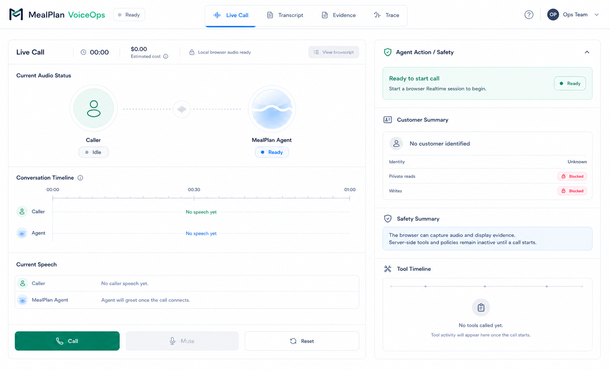
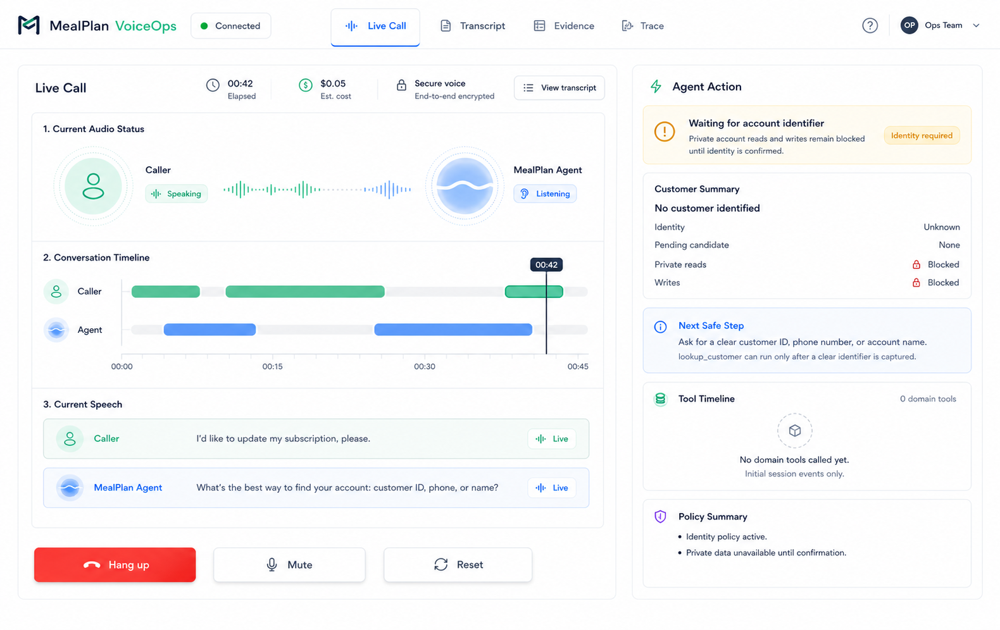
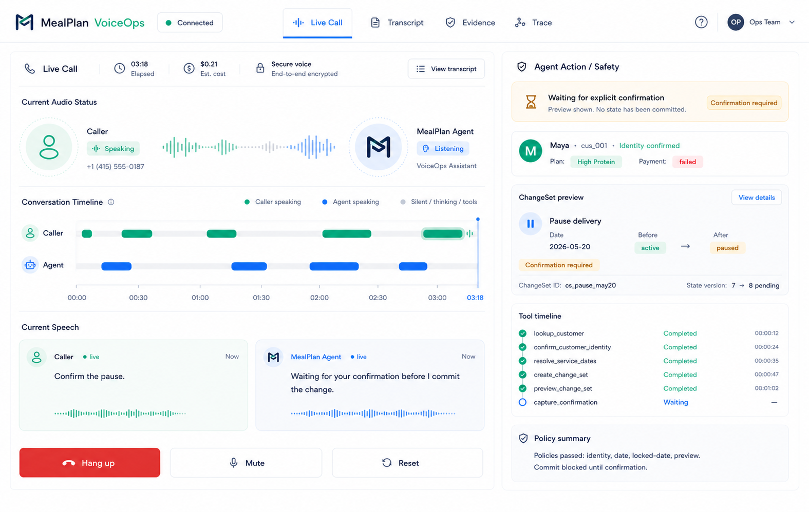

# CODS-186 Live Call Design Contract

This is the component contract for the Live Call tab polish under `CODS-186`.

The generated mocks below are composition references. They show layout direction,
visual density, and state intent, but the component behavior in this document is
the source of truth for implementation.

## Composition References

### Initial / Ready

### Connected / No Identity

### Confirmed Customer / ChangeSet Preview

## Page Structure

The voice console should use four top-level tabs:

- `Live Call`: summary cockpit for the current session.
- `Transcript`: full caller and agent transcript history.
- `Evidence`: structured realtime evidence, tool evidence, and policy evidence.
- `Trace`: lower-level realtime/session diagnostics.

The Live Call tab must not become a raw evidence dump. It should show the state a
human operator needs during the call: elapsed time, estimated cost, audio state,
identity status, current tool/action, safety status, and the latest speech.

## Live Call Components

### Header Status

- Shows product name, active tab, connection state, and operator affordances.
- Connection state variants: `ready`, `connecting`, `connected`, `ended`, `error`.
- The top status is the source of truth for connection state. Do not duplicate a
  separate "call connected" footer.

### Call Metrics

- Shows elapsed call time.
- Shows estimated realtime cost once telemetry is available.
- Shows security/session status in plain operational language.
- Metrics must remain visible in all Live Call states.

### Current Audio Status

- Shows caller and MealPlan Agent as two endpoints.
- Shows caller state: `idle`, `speaking`, `muted`, `unavailable`.
- Shows agent state: `ready`, `listening`, `thinking`, `speaking`, `tooling`.
- Audio waves are live visual indicators only. They must not be treated as
  operational evidence.

### Conversation Timeline

- Shows two fixed lanes: `Caller` and `Agent`.
- Represents when each side spoke over the life of the call.
- Uses green segments for caller speech and blue segments for agent speech.
- Shows silent, thinking, or tool time as neutral gaps/background.
- Initial state still renders both lanes with "No speech yet" placeholders.
- This component is always visible on the Live Call tab.

### Current Speech

- Shows exactly two current/latest speech slots: caller and MealPlan Agent.
- Each slot shows speaker, current status, latest text fragment, and optional
  mini waveform.
- This is not the full transcript. Older turns belong in the Transcript tab.

### Call Controls

- Always render three primary controls in the same order:
  - Start state: `Call`, disabled `Mute`, `Reset`.
  - Active state: `Hang up`, `Mute`, `Reset`.
  - Ended state: `Call again`, disabled `Mute`, `Reset`.
- `Reset` clears the session and evidence view. `Hang up` stops the active call
  but keeps the visible call history until reset.

## Agent Action / Safety Components

### Agent Action Banner

- Shows the current highest-signal action or blocker.
- Examples: ready to start, waiting for identifier, verifying identity, running a
  tool, waiting for explicit confirmation, blocked by policy, escalated.
- The banner should be derived from server/browser state, not assistant copy.

### Customer Summary

- Shows identity state: unknown, pending candidate, confirmed, or uncertain.
- When confirmed, show the customer name, customer ID, plan, and relevant risk
  flags such as payment failed or allergy risk.
- When unknown, show that private reads and writes are blocked.
- Use the same component variant across all Live Call states.

### ChangeSet Preview

- Appears only when there is an active pending or previewed ChangeSet.
- Shows operation type, affected date or field, before/after values, ChangeSet
  ID, state version, and confirmation requirement.
- Must make clear when no state has been committed yet.

### Tool Timeline

- Shows compact domain tool calls in chronological order.
- Includes tool name, status, timestamp or elapsed time, and short result label.
- Status variants: queued, running, completed, blocked, failed, waiting.
- This is a summary. Full inputs, outputs, and evidence stay in Evidence/Trace.

### Policy Summary

- Shows the current deterministic safety result.
- Examples: identity policy active, private reads blocked, policies passed,
  commit blocked until confirmation, escalation required.
- Do not hide policy or tool failures behind friendly assistant text.

## Cross-State Rules

- The left panel structure remains stable across the three baseline states.
- The right panel reuses the same component set; it should not be redesigned per
  state.
- Empty states are real states, not missing UI.
- Browser code owns display, mic, and WebRTC interaction only. Server code owns
  tools, policies, confirmations, writes, audit, and evidence.
- Keep Live Call readable on laptop widths before adding decorative detail.
- Prefer operational clarity over animation. Animations must not shift layout.

## Worker Handoff Notes

- `CODS-197` and `CODS-198` should establish the view model and tab shell first.
- `CODS-199`, `CODS-200`, and `CODS-201` should implement from this contract,
  not from one-off image differences.
- `CODS-202` should move full transcript/evidence/trace detail out of Live Call
  while preserving inspectability.
- `CODS-191` should use the completed implementation for the final screenshot.
